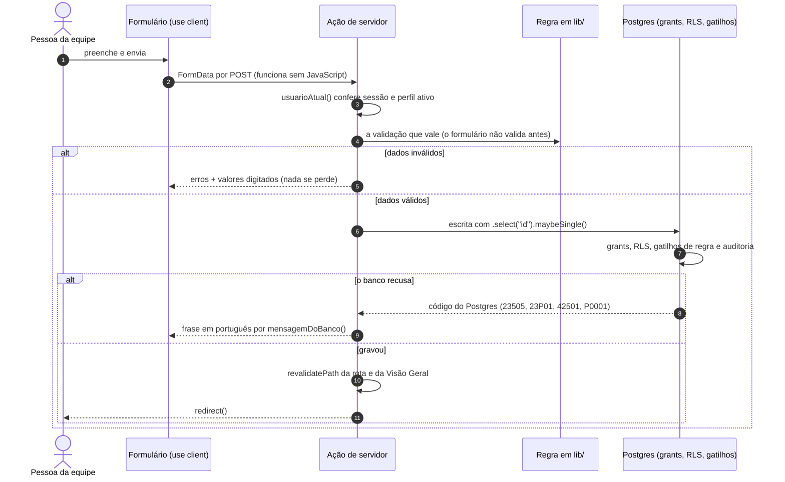
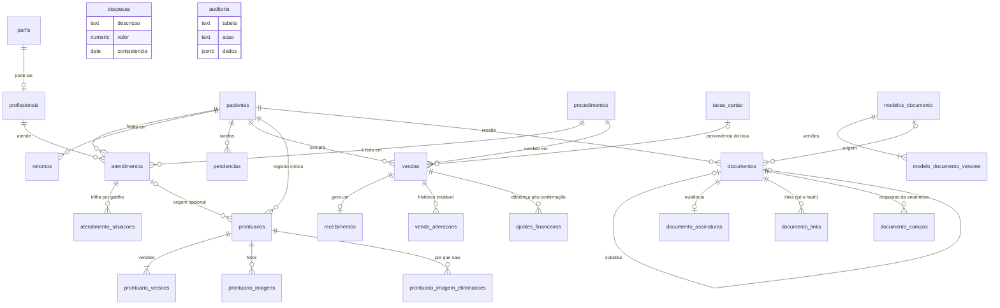

<div align="center">


<br>

[](https://nextjs.org)
[](https://react.dev)
[](tsconfig.json)
[](src/app/globals.css)
[](supabase/README.md)
[](supabase/migrations)
[](vercel.json)

[](#testes)
[](supabase/testes/permissoes.sql)
[](e2e)
[](.github/workflows/ci.yml)
[](eslint.config.mjs)
[](#seguranca)
[](AGENTS.md)

**Agenda · Pacientes · Prontuários · Financeiro · Documentos e Contratos · Relacionamento · Indicadores**<br>
O sistema de gestão do consultório de estética da **Dra. Érika Passos** — no lugar da agenda de papel,<br>
do caderno, das conversas de WhatsApp e da planilha. Com o banco de dados como última linha de defesa.

[Módulos](#modulos) ·
[Perfis](#perfis) ·
[Arquitetura](#arquitetura) ·
[Segurança](#seguranca) ·
[Dinheiro](#dinheiro) ·
[Assinatura](#assinatura) ·
[Banco](#banco) ·
[Rodar](#rodar) ·
[Testes](#testes) ·
[Documentação](#documentacao)

</div>

<br>


<details>
<summary><b>Todos os números</b> — contados no código em 23/09/2026</summary>

| Onde | Quanto |
|---|---|
| Páginas (`page.tsx`) | **48** — 43 autenticadas em `(app)` e 5 públicas |
| Componentes React | **96**, em 10 pastas (documentos e financeiro são as maiores) |
| TypeScript em `src/` | ~**43 mil linhas** em 296 arquivos, testes incluídos (~33 mil em 224 sem eles; 1.922 são os tipos gerados do banco) |
| Migrações SQL | **28**, somando ~**8,1 mil linhas** (a maior, 0022, tem 1.237) — 0019 a 0028 ainda não aplicadas em produção |
| Tabelas no schema `public` | **25** — todas com RLS; só uma com DELETE (fotos, pela LGPD) |
| Políticas de RLS | **63** (60 em `public` + 3 no Storage) — menos que antes porque a 0023 tirou as de escrita direta em venda, histórico e ajuste |
| Gatilhos | **67**, dos quais **20** de auditoria |
| Funções no banco | **50** — 23 em `public`, 27 em `private`; 17 chamadas pela aplicação, **4** alcançáveis por `anon` |
| Verificações automatizadas | **1317** — 825 Vitest · 194 SQL por perfil · 298 Playwright (251 Chromium, 43 WebKit, 4 iPhone 13) |
| Dependências | **7** de execução, 18 de desenvolvimento |
| Histórico | **40 commits**, de 01/08/2026 a 23/09/2026, num único branch (`jamal-do-mal`) |

</details>

> [!IMPORTANT]
> **Software real, para uma clínica real, com dado de saúde de pessoas reais.** Dado de paciente é dado
> pessoal sensível (LGPD, art. 5º, II) — por isso a RLS está ligada em toda tabela, a chave `service_role`
> não existe na aplicação e nenhum registro se apaga pela API (a única exceção é foto de evolução, a pedido
> da titular; garantia da migração 0019, que ainda aguarda aplicação em produção — ver [Segurança](#seguranca)).
> Hoje o sistema roda com **dados de demonstração**, marcados no banco pela coluna `exemplo`:
> enquanto houver uma paciente assim, a interface mostra uma faixa permanente de aviso.


## Por que existe

Um consultório pequeno vive espalhado: a agenda no papel, a ficha no caderno, a confirmação no WhatsApp e
o caixa na planilha. O Cockpit junta tudo em uma tela — o dia da clínica, o que precisa de atenção e quem
está no período de voltar — sem pedir que a equipe trabalhe mais para isso.

Seis princípios atravessam o código inteiro:

| | Princípio | Na prática |
|:-:|---|---|
| 🛡️ | **O banco decide** | Interface e servidor conferem, mas a última palavra é da RLS, dos grants e dos gatilhos do Postgres. Esconder o botão não é proteger a rota |
| 🪙 | **Centavo não se perde** | Todo cálculo de dinheiro em centavos inteiros e pontos-base, com um único arredondamento — e o banco confere de novo |
| 🕰️ | **O relógio é o da clínica** | "Hoje" é o dia de São Paulo (`America/Sao_Paulo`), qualquer que seja o fuso do servidor |
| 🧾 | **Nada some sem rastro** | Sem DELETE pela API; corrigir é cancelar, ajustar, versionar ou arquivar — e a auditoria guarda quem mudou o quê |
| 🎨 | **Cor com significado** | Azul é a marca; vermelho, laranja, verde e azul informativo são estados — e estado nunca vem só na cor |
| 🇧🇷 | **Tudo em português** | Interface, mensagens, funções, variáveis, colunas, migrações e commits |

<a id="modulos"></a>

## Módulos


| Módulo | Rota | O que faz hoje | Estado |
|---|---|---|:-:|
| **Visão Geral** | `/` | Cabine do dia (quem está em atendimento, a próxima, os números do dia e do mês e a fila do dia com marcador "agora"), atalhos de teclado, pendências, retornos, caixa do mês e aniversários | ✅ Pronto |
| **Agenda** | `/agenda` | Marcar, remarcar e acompanhar o dia; sete situações com trilha gravada por gatilho; choque de horário recusado pelo banco | ✅ Pronto |
| **Pacientes** | `/pacientes` | Cadastro com CPF validado, busca, ficha com histórico, arquivamento e importação de planilha em dois passos | ✅ Pronto |
| **Prontuários** | `/prontuarios` | Registro clínico versionado e fotos de evolução em bucket privado — só a administradora | ✅ Pronto |
| **Financeiro** | `/financeiro` | Vendas, recebimentos, despesas, taxas de cartão, movimentações e fluxo mensal, com filtros na URL | ✅ Pronto |
| **Documentos e Contratos** | `/formularios` | Modelos versionados, emissão com texto congelado + SHA-256, assinatura no balcão ou por link, anamnese | ✅ Pronto |
| **Relacionamento** | `/relacionamento` | Confirmações dos próximos 15 dias, retornos, tarefas, aniversários e convites para avaliação no Google | ✅ Pronto |
| **Busca global** | `/busca` | Pacientes, atendimentos, documentos e — para a administradora — prontuários, respeitando a RLS | ✅ Pronta |
| **Configurações** | `/configuracoes` | Tabela de procedimentos; equipe, dados da clínica, horário e permissões ainda "em breve" | 🟠 Parcial |
| **Relatórios** | `/relatorios` | Página provisória: navegável, descreve o que virá e avisa que está em construção | ⏳ Provisória |

<details>
<summary><b>Pacientes</b> — cadastro, busca e importação de planilha</summary>

- **Só o nome é obrigatório** (mínimo 3 caracteres). CPF, telefone, e-mail e nascimento são opcionais — e validados quando informados.
- CPF confere os dois dígitos verificadores e recusa sequências de um dígito só. **CPF repetido é recusado pelo índice único do banco**, não só pela tela.
- **Nome social tem precedência em toda a interface.** Observações são administrativas; conteúdo clínico vai para o prontuário.
- **Não existe excluir paciente.** Arquivar tira da lista, preserva tudo e é reversível no clique seguinte.
- **Ficha inexistente e ficha sem permissão devolvem a mesma tela** — dizer que o registro existe já é informação.
- Busca por nome, nome social, e-mail e telefone; com 3 dígitos ou mais, a pontuação é ignorada e a busca procura também no CPF. Caracteres da gramática do PostgREST e curingas do `ilike` são retirados do termo.
- **Importação CSV** (só administradora): dois passos, nada gravado antes da confirmação; o arquivo é **reprocessado no servidor**; separador `;` detectado fora das aspas; UTF-8 estrito com queda para Windows-1252; colunas reconhecidas pelo nome; a mesma validação do cadastro manual; lotes de 100 com reenvio linha a linha; até 2 MB e 2000 linhas.

</details>

<details>
<summary><b>Agenda</b> — o dia na ordem do relógio</summary>

- Escolher o procedimento preenche duração e valor da tabela, editáveis caso a caso.
- O seletor de paciente **busca no servidor** e devolve até 8 opções — a base nunca desce inteira para o navegador. Funciona pelo teclado.
- **Choque de horário é recusado pelo banco** (migração 0021): o gatilho trava o profissional (`pg_advisory_xact_lock`) e compara o intervalo inteiro — duas recepcionistas marcando o mesmo horário no mesmo segundo não passam juntas.
- Sete situações: agendado · aguardando confirmação · confirmado · em atendimento · concluído · cancelado · não compareceu. Toda mudança entra em `atendimento_situacoes` por gatilho, com autor e hora.
- Os botões de situação são `<form>` de verdade: funcionam sem JavaScript.

</details>

<details>
<summary><b>Prontuários e fotos de evolução</b> — o dado mais sensível do sistema</summary>

- Conteúdo clínico nunca é sobrescrito: alterar cria nova linha em `prontuario_versoes`, com motivo, autor e data.
- Fotos em **bucket privado** (`prontuario-imagens`, até 10 MB cada, jpeg/png/webp, até 12 por envio), exibidas por URL assinada de **15 minutos** — nunca URL pública, e nada de `next/image` (o otimizador copiaria a foto para fora do bucket).
- **O arquivo não passa pela ação de servidor**: o navegador envia direto ao Storage, e o servidor relê tamanho e tipo do objeto antes de gravar a linha.
- **Eliminar é a única exceção ao "não se apaga"** — pela LGPD (art. 18, VI), a pedido da titular, com motivo guardado e o arquivo removido **antes** da linha, para nunca sobrar dado de saúde sem dono.

</details>

<details>
<summary><b>Relacionamento, Busca e Visão Geral</b></summary>

- **Relacionamento**: fila de acompanhamento, confirmações dos próximos 15 dias, retornos com data escolhida pela equipe (o sistema **não** recomenda período clínico), tarefas de contato, aniversários e convites para avaliação no Google — texto pronto para abrir no WhatsApp ou copiar. O envio é manual e a equipe marca quando enviou.
- **Busca global**: formulário GET em `/busca?q=`, a partir de 2 caracteres e até 80; datas em `dd/mm/aaaa` interpretadas no fuso da clínica; nunca lê conteúdo clínico nem consolidado financeiro.
- **Visão Geral**: a cabine do dia (o agora, os números do dia e do mês e a fila do dia em cartões), atalhos N/A/V/T que dá para desligar, pendências, retornos, caixa do mês com os últimos seis meses e aniversários do mês. Em toda tela, a barra de módulos no topo e a faixa do agora logo abaixo.

</details>

<a id="perfis"></a>

## Perfis e permissões

Três perfis, e cada regra de acesso é conferida em **três camadas**: a interface não oferece a porta, a ação de
servidor recusa com uma frase legível e a RLS do banco recusa mesmo que as outras duas sejam contornadas.
Algumas regras ficam de propósito só na aplicação — a importação de planilha restrita à administradora, a
data de pagamento de despesa que não pode estar no futuro, o tamanho mínimo do motivo —, e o [`AGENTS.md`](AGENTS.md) (§5, "Onde a
terceira camada não existe hoje") lista cada uma.

| O que | Recepção | Financeiro | Administradora |
|---|:-:|:-:|:-:|
| Pacientes, agenda, retornos e tarefas | ✅ | ✅ | ✅ |
| Registrar venda com a taxa padrão (e marcá-la "já recebida" quando pagou no balcão) | ✅ | ✅ | ✅ |
| Ver vendas, movimentações e os números de entrada do Financeiro | ✅ | ✅ | ✅ |
| Emitir e colher assinatura de contrato, termo e orientação | ✅ | ✅ | ✅ |
| Confirmar recebimento depois · lançar e pagar despesa | — | ✅ | ✅ |
| Alterar forma de pagamento ou taxa (com motivo) | — | ✅ | ✅ |
| Despesas, resultado de caixa e fluxo mensal | — | ✅ | ✅ |
| Configurar a tabela de taxas de cartão | — | — | ✅ |
| Importar planilha de pacientes | — | — | ✅ |
| Criar e versionar modelos de documento | — | — | ✅ |
| Prontuários, fotos de evolução e anamnese | — | — | ✅ |
| Editar procedimentos | — | — | ✅ |

Conta nova nasce **inativa** e como **recepção**, sempre — o papel não vem do metadado do cadastro (a
migração 0004 fechou essa escalada de privilégio). Liberar e promover são ações da administradora.


<a id="arquitetura"></a>

## Arquitetura


| Camada | Tecnologia | Onde |
|---|---|---|
| Aplicação | Next.js 15 (App Router) · React 19 · TypeScript estrito · Tailwind CSS v4 · `lucide-react` | **Vercel**, região `gru1` (São Paulo) |
| Banco e autenticação | Postgres + Auth + Storage do **Supabase** (`@supabase/ssr`) | região `us-west-2` (Oregon, EUA), por decisão do dono |
| Qualidade | Vitest + Testing Library · SQL de permissões por perfil · Playwright | Supabase local em Docker — nada toca produção |

Poucas dependências, de propósito: o leitor de CSV foi escrito à mão porque nenhuma biblioteca resolve ao
mesmo tempo as três particularidades da planilha brasileira; a fonte (Hanken Grotesk) vem por `next/font`,
sem requisição externa em tempo de execução.

### As regras da casa

1. **Componente não conversa com o banco.** Leitura em `src/server/consultas/` (`server-only`), escrita em `src/server/acoes/` (`"use server"`).
2. **Toda ação abre com `usuarioAtual()`.** O layout protege a página, não o POST direto numa server action.
3. **A regra mora em `lib/`, e todo caminho de escrita passa por ela** — a ação chama `validarPaciente`, `calcularVenda`, `validarDespesa`; o formulário (`noValidate`) mostra os erros que ela devolve e usa de `lib/` só listas, rótulos e a conta da prévia.
4. **Estado de tela mora na URL**: busca, filtro, página, dia da agenda e mês do financeiro. Recarregar, voltar e mandar o link funcionam.
5. **Botão de ação é formulário de verdade** e devolve `ResultadoAcao`; a recusa aparece ao lado do botão.
6. **Toda escrita confere que alcançou uma linha** — RLS que esconde a linha não dá erro, dá zero linhas, e zero linhas não é sucesso.
7. **Erro de banco vira português** por `mensagemDoBanco()`; o detalhe técnico vai sanitizado para o log. Nada de `error.message` cru na tela.
8. **Nenhuma ação usa `try/catch`, e `redirect()` é a última linha**: valida → escreve → checa erro → `revalidatePath` → `redirect`.
9. **A RLS filtra em silêncio** — em soma sobre tabela restrita, "não posso ver" vira `null`, nunca zero.



<a id="seguranca"></a>

## Segurança e LGPD


**O que o banco garante sozinho**, mesmo contra quem chama a API direto com a chave anônima:

> [!NOTE]
> As migrações **0019 a 0028** estão escritas e verificadas no banco local (do zero, com o seed e com
> `npm run test:banco`), e foram **aplicadas em produção em 23/09/2026**, antes do primeiro deploy — ver
> [`supabase/README.md`](supabase/README.md#pendente-de-aplicação-em-produção). Antes disso, as garantias
> marcadas com esses números neste README valiam só no banco local e nos testes. **Banco primeiro,
> código depois:** o código atual não funciona contra o banco anterior à 0025, então o merge/deploy
> só vem depois do `db:push` (roteiro no link acima). O app novo sempre manda a chave do envio para `venda_registrar`:
> contra um banco sem a 0028, o registro de venda para (`PGRST202`). **Antes do deploy, preencha
> `ORIGEM_PUBLICA` na Vercel:** em produção, vazia, o link de assinatura à distância é recusado
> (`AGENTS.md` §3).

- **Privilégio mínimo** (0019): cada tabela declara seus grants; o padrão não concede nada a `authenticated`; políticas separadas por operação, **sem DELETE** em lugar nenhum — exceto fotos de evolução, pela LGPD.
- **Dinheiro conferido na origem** (0020): a taxa de toda venda precisa vir da tabela padrão (ou ser manual, pelo financeiro) e o valor precisa bater com o arredondamento do sistema; recebimento confirmado não se reescreve.
- **Agenda sem choque** (0021): sobreposição recusada com `23P01`, sob trava por profissional.
- **Documento à prova da API** (0022): documento só nasce do texto do modelo e só muda de situação; hash, hora, canal e operador da assinatura são escritos pelo banco; pergunta da anamnese congela.
- **Venda só pela função** (0023): ninguém insere nem altera venda, histórico ou ajuste pela API; toda venda nasce com exatamente um recebimento; o recebimento previsto não diverge da venda; confirmação sem data futura e "recebido" só pelo líquido previsto.
- **Fotos sem troca de arquivo** (0024): a API só altera legenda, data, arquivamento e ordem; a administradora vê as sobras entre Storage e tabela (detecta, não apaga); `anon` não gera id de sequência nenhuma.
- **Contato estruturado** (0025): o Relacionamento reconhece registro de contato por coluna, não por texto, com um registro por paciente, origem e dia.
- **Marca de exemplo fora da API** (0026): com sessão, ninguém grava nem troca `exemplo = true` — o `dados:limpar` só apaga o que o seed marcou.
- **O banco escreve a evidência** (0027): versão de modelo na sequência, quem respondeu a anamnese e quando, autor e data da foto; a via diz o canal da assinatura.
- **Venda idempotente e foto só com arquivo** (0028): o mesmo envio do formulário de venda devolve a venda já criada, sem segunda venda nem segundo recebimento (chave do envio + índice único); a linha da foto só nasce se o objeto existir no bucket, com tipo e tamanho lidos do Storage.
- **Funções auxiliares no schema `private`**, fora do que o PostgREST publica; funções novas nascem com `search_path` fixo e sem `EXECUTE` para `anon`.
- **Auditoria por gatilho** em 20 tabelas: toda tabela editável com dado de paciente, de dinheiro ou de acesso.

**Na borda:**

| Proteção | Como |
|---|---|
| Sessão | `getUser()` — que valida o token no servidor do Supabase — e nunca `getSession()`; middleware renova a sessão a cada requisição |
| Embutir em outro site | `Content-Security-Policy: frame-ancestors 'none'` + `X-Frame-Options: DENY` |
| Tipo de arquivo | `X-Content-Type-Options: nosniff` |
| Scripts e origens | CSP com nonce por requisição (`src/lib/politica-de-conteudo.ts`, enviada pelo middleware); script só com nonce + `'strict-dynamic'`; `'unsafe-inline'` só no atributo `style` |
| Buscadores | `X-Robots-Tag: noindex, nofollow` em tudo |
| Token de assinatura | `Referrer-Policy: no-referrer`, `Cache-Control: no-store` e `noarchive` em `/assinar/*`; origem do link fixada por `ORIGEM_PUBLICA` |
| Login | redirecionamento pós-login só para caminho interno (`destinoSeguro`) |
| Log | uma linha JSON por falha (`"app":"cockpit"`, código, contexto e id de correlação), sanitizada (e-mail, token, CPF, telefone, data viram marcadores) — pronta para log drain |
| Recursos do aparelho | câmera, microfone, localização, pagamento e USB desligados por `Permissions-Policy` |
| Chave `service_role` | **não entra na aplicação** — nem `.env.local`, nem Vercel, nem navegador |

<a id="dinheiro"></a>

## Dinheiro que não erra centavo


- **Cartão parcelado, repasse único.** A paciente parcela, a operadora antecipa, a clínica recebe **uma vez** — uma venda em 5x gera **um** recebimento.
- **A taxa é da clínica, não da paciente**: desconta do valor final, nunca acrescenta — e **nunca vira despesa** (contar de novo dobraria o custo).
- **A taxa é copiada na venda.** Mudar a tabela padrão amanhã não muda o que já foi vendido. Taxa manual exige justificativa e não toca a tabela.
- **Gravação composta é função do banco**: `venda_registrar` e `venda_alterar_pagamento` fazem tudo ou nada.
- **Confirmado não se reescreve**: mudança depois da confirmação vira linha em `ajustes_financeiros`; toda alteração entra em `venda_alteracoes`, com motivo, autor e hora.
- **"Vencida" é derivada**, nunca gravada — estado gravado envelheceria errado à meia-noite.

```text
taxa (centavos)    = round(valor_final × pontos_base ÷ 10000)      6,5% = 650 pontos-base
valor_original − desconto   = valor_final                           ← CHECK no banco
valor_final    − taxa_valor = valor_liquido                         ← CHECK no banco
resultado de caixa = líquido recebido − despesas pagas              (lucro não entra: regra ainda não definida)
```

<a id="assinatura"></a>

## Documentos e assinatura à distância


- **Quem congela o texto é o banco.** `documento_emitir` lê o corpo da versão vigente do modelo dentro da própria função e o gatilho calcula o SHA-256 — se o texto viesse por parâmetro, o hash atestaria qualquer coisa.
- **Dois caminhos de assinatura, e o registro diz qual**: no **balcão** (alguém confere documento com foto) ou por **link** (posse do link + data de nascimento). IP e dispositivo vêm dos cabeçalhos da requisição, nunca do formulário.
- **O token não é guardado** — só o SHA-256 dele. Perdido, gera-se outro e o anterior é revogado na mesma transação.
- **Data de nascimento é o segundo fator**, e o link se fecha no décimo erro seguido (com a linha travada por `for update`, para "dez" ser exatamente dez). A validade — 7, 15 ou 30 dias — é escolhida ao gerar o link, e só um link fica vivo por documento.
- **`anon` alcança quatro funções e nenhuma tabela**: `documento_link_estado`, `documento_para_assinatura`, `documento_assinar_por_link` e `documento_responder_por_link`.
- **A via da paciente**: assinar não fecha o link; ela volta até o vencimento e salva em PDF pela impressão do navegador.
- **Anamnese** com sete tipos de campo (texto, texto longo, sim/não, escolha única, escolha múltipla, data, número): **a pergunta congela, a resposta vive** — e cada mudança fica na auditoria.

## Design


Estrutura, tipografia e espaçamento vêm de um mockup do Google Stitch (`docs/redesign`) — **a paleta não**:
o verde do mockup passou a significar "deu certo" e não podia continuar sendo a cor do menu. Todo token de
cor, raio e sombra mora em [`src/app/globals.css`](src/app/globals.css); todo par texto/fundo dos tokens passa
no WCAG AA (o texto terciário `--color-outline` foi escurecido e dá 4,74:1 no pior fundo — [`AGENTS.md`](AGENTS.md) §7.4);
foco sempre visível; atalho "Ir para o conteúdo"; `prefers-reduced-motion` respeitado; botão indisponível
fica visível, com a razão no `title`. 41 endereços (36 telas do sistema, com a 404 logada, e 5 públicas) são testados sem rolagem
horizontal em 320, 768 e 1440 px.


<a id="banco"></a>

## Banco de dados

Postgres gerenciado pelo Supabase, em São Paulo. **Toda alteração de estrutura passa por uma migração
versionada** em [`supabase/migrations/`](supabase/migrations) — nada é alterado pelo painel.



<details>
<summary><b>As 28 migrações</b>, da fundação à venda idempotente</summary>

| Arquivo | O que faz |
|---|---|
| `0001_fundacao.sql` | Núcleo: perfis, equipe, procedimentos, pacientes, agenda, relacionamento, financeiro básico e auditoria. RLS ligada em tudo |
| `0002_endurece_funcoes.sql` | `search_path` fixo nas funções; funções de gatilho fora da API pública |
| `0003_funcoes_em_schema_privado.sql` | Funções auxiliares das políticas no schema `private` |
| `0004_cadastro_nao_concede_acesso.sql` | Perfil novo nasce inativo e como recepção; o papel deixa de vir do metadado do cadastro |
| `0005_marca_dados_de_exemplo.sql` | Coluna `exemplo` nas tabelas de conteúdo |
| `0006_financeiro_enums.sql` | Enums do Financeiro (numa migração própria: o Postgres não usa valor novo de enum na mesma transação) |
| `0007_financeiro_fundacao.sql` | Vendas, taxas de cartão, histórico de alterações e ajustes; a conta fecha por CHECK |
| `0008_operacoes_de_venda.sql` | `venda_registrar` e `venda_alterar_pagamento`: tudo ou nada |
| `0009_anon_fora_das_tabelas_novas.sql` | `anon` revogado das tabelas novas e do padrão das futuras |
| `0010_prontuarios.sql` | Prontuários versionados, restritos à administradora |
| `0011_prontuario_imagens.sql` | Fotos de evolução: bucket privado, metadados e as primeiras políticas de Storage |
| `0012_eliminacao_de_imagem.sql` | O motivo da eliminação e a função que registra e apaga na mesma transação |
| `0013_documentos.sql` | Modelos versionados, texto congelado com hash e a trilha da assinatura |
| `0014_assinatura_por_link.sql` | Assinatura à distância — a primeira superfície anônima: três funções, nenhuma tabela |
| `0015_canal_do_link.sql` | `grant update` de coluna em `canal_envio`: o canal é gravado no clique do envio |
| `0016_via_da_paciente.sql` | Assinar deixa de revogar o link; a paciente guarda a via do que assinou |
| `0017_anamnese.sql` | Anamnese: perguntas versionadas no modelo, respostas em `documento_campos` |
| `0018_emissao_grava_perguntas.sql` | As perguntas entram só por `private.documento_campos_criar` |
| `0019_privilegio_minimo.sql` | Grants declarados, uma política por operação, sem DELETE, auditoria ampliada |
| `0020_financeiro_conferido_no_banco.sql` | Origem da taxa conferida por gatilho; recebimento confirmado imutável |
| `0021_agenda_sem_choque.sql` | Choque de horário recusado pelo banco, com trava por profissional |
| `0022_documentos_integridade.sql` | Documento só nasce do modelo e só muda de situação; evidência escrita pelo banco |
| `0023_venda_so_pela_funcao.sql` | Venda, histórico e ajuste só pelas funções (agora `SECURITY DEFINER`); recebimento com UPDATE por coluna e confirmação coerente |
| `0024_fotos_reconciliacao_e_arestas.sql` | Reconciliação das fotos (só leitura); UPDATE por coluna nas fotos; sequências sem `anon` |
| `0025_contato_estruturado_e_arestas.sql` | `pendencias.origem` no lugar do texto; busca sem acento; teto do título do prontuário |
| `0026_marca_de_exemplo_e_privilegios.sql` | A marca de dado de exemplo não se grava pela API; sequência nova só com USAGE |
| `0027_banco_escreve_a_evidencia.sql` | Versão de modelo, autor da resposta e autor e data da foto escritos pelo banco; a via diz o canal da assinatura; recebimento sem taxa maior que o valor |
| `0028_venda_idempotente_e_foto_do_arquivo.sql` | Venda idempotente pela chave do envio (`vendas.chave_envio`, `p_chave` em `venda_registrar`); foto só com o objeto no bucket, tipo e tamanho do Storage; IP e dispositivo da assinatura marcados como declarados |

O detalhe de cada uma está em [`supabase/README.md`](supabase/README.md) e no [`AGENTS.md`](AGENTS.md) §4.

</details>


<a id="rodar"></a>

## Rodando localmente

> [!NOTE]
> Precisa de **Node 22+** (o `@supabase/supabase-js` 2.117 declara `engines: node >=22`; com Node 20 o `npm ci`
> avisa `EBADENGINE`) e **Docker** (para o Supabase local, com Postgres 17). Nada aqui toca o banco de produção.

```bash
npm ci
npx supabase start          # Postgres local: aplica as 28 migrações e os dados de exemplo
npm run local:usuarios      # cria as contas de teste: administradora, financeiro e recepção
cp .env.local.example .env.local
npm run dev                 # http://localhost:3000
```

No `.env.local`, use a URL e a chave anônima que o `supabase start` imprime:

```dotenv
NEXT_PUBLIC_SUPABASE_URL=http://127.0.0.1:55321
NEXT_PUBLIC_SUPABASE_ANON_KEY=<chave anônima local impressa pelo supabase start>
```

As contas e a senha de teste estão em [`supabase/usuarios-locais.json`](supabase/usuarios-locais.json) — só
existem no banco local. O Studio local abre em <http://127.0.0.1:55323>. As portas são 5532x, e não as 5432x
padrão, porque o Windows reserva a faixa 54286–54385 para o Hyper-V. Sem as duas variáveis de ambiente, a
aplicação não sobe — de propósito.

> [!WARNING]
> `npm run db:push`, `db:tipos`, `dados:exemplo` e `dados:limpar` usam `--linked` e falam **direto com o banco
> de produção da clínica**. Confirme com o dono do projeto antes de rodar qualquer um (ver [`AGENTS.md`](AGENTS.md) §2).

> [!CAUTION]
> **Não rode `npm run build` com o `npm run dev` no ar.** Os dois escrevem na mesma pasta `.next`: a página abre
> sem CSS nenhum e algumas rotas dão 500. Conserto: pare o dev, apague `.next`, suba de novo e recarregue com Ctrl+Shift+R.

<a id="testes"></a>

## Testes

Três camadas, **1292 verificações automatizadas** — e nenhuma toca produção.

| Camada | Comando | Quanto | O que confere |
|---|---|---|---|
| Unidade e componente | `npm test` | **825 testes** em 79 arquivos | Dinheiro, datas no fuso da clínica, CPF, CSV, erros do banco, login e redirecionamento, middleware, cabeçalhos de segurança, **44 das 47 ações de servidor** com um Supabase falso e componentes (jsdom + Testing Library) |
| Banco | `npm run test:banco` | **194 asserções**, todas verdes do zero (`db reset` + seed, 23/09/2026) | RLS, grants e gatilhos **por perfil**, trocando de papel como a API troca — numa transação desfeita no fim |
| Navegador | `npm run test:e2e` | **298 testes**: Chromium 251 (43 de fluxo + 126 de telas: 41 endereços × 3 larguras + 3 + 82 de acessibilidade com axe: 41 endereços × 2 larguras), WebKit 43, iPhone 13 4 | Login e redirecionamento seguro, permissões por perfil pela URL, paciente, agenda, venda, despesa, prontuário, fotos, importação, Relacionamento, procedimentos, busca, 404, CSP, documento e assinatura por link (também no WebKit e no celular); 41 endereços em 320, 768 e 1440 px, sem rolagem horizontal nem erro de console, e sem violação WCAG 2.2 A/AA (axe) em 360 e 1440 px |

Os dois últimos precisam do Supabase local no ar com as contas de teste; o E2E recusa rodar se o `.env.local`
não apontar para `127.0.0.1`. Na primeira vez: `npx playwright install chromium webkit`. Um projeto só:
`npx playwright test --project=webkit`.

**Antes de dar qualquer trabalho por concluído:** `npm run lint`, `npm run typecheck` e `npm test` limpos —
mudou banco ou permissão, `npm run test:banco` também; mexeu em tela ou fluxo, `npm run test:e2e`.

**Gates finais (23/09/2026, cópia limpa com `npm ci`):** lint 0 erros e 0 avisos · tipos 0 erros · Vitest
800/800 · build sem aviso · `npm audit` 0 vulnerabilidades (com e sem `--omit=dev`) · `db reset` 0001–0028 +
`test:banco` 194/194 · Playwright Chromium (fluxos, telas e segurança) **contra o build de produção**: 142/142,
sem nova tentativa. O E2E completo contra o `next dev` compartilhado fechou 280/298 na primeira passada e as 18
restantes passaram repetidas — todas por lentidão do dev, nenhuma com erro de negócio.

> [!NOTE]
> **CI em [`.github/workflows/ci.yml`](.github/workflows/ci.yml)**: qualidade (lint, tipos, Vitest), banco
> (migrações, seed e `test:banco` num Supabase local dentro do runner), E2E (Chromium e WebKit sobre o build de
> produção) e build. Nenhum job usa banco real nem segredo da clínica. **Ainda não rodou no GitHub.** O branch
> `jamal-do-mal` está protegido desde 23/09/2026 contra force push e exclusão, inclusive para administradores; o
> push direto continua, então a CI avisa mas não barra (ver [`AGENTS.md`](AGENTS.md) §2). Os números deste README
> são a contagem do estado atual (23/09/2026), não um selo de build.

**Desempenho** ([`scripts/desempenho.mjs`](scripts/desempenho.mjs), medido num `next start` de cópia em 23/09/2026):
First Load JS compartilhado de 102–103 kB e rotas entre 103 e 121 kB — as exceções são `/prontuarios/[id]` (185 kB)
e `/redefinir-senha` (179 kB), que carregam o cliente do Supabase no navegador. O orçamento reprova acima de 110 kB
compartilhado, 130 kB por rota (195 e 190 kB nas duas exceções) e TTFB p95 de 150 ms nas telas públicas e 1,5 s
nas internas, com 200 requisições e 10 simultâneas no Supabase local. O gargalo medido é o `getUser()` do Auth,
feito duas vezes por tela interna (ver [`AGENTS.md`](AGENTS.md) §10).

<details>
<summary><b>Todos os comandos</b></summary>

| Comando | O que faz |
|---|---|
| `npm run dev` | Servidor de desenvolvimento |
| `npm run build` · `npm start` | Build de produção e servidor do build (nunca com o `dev` no ar) |
| `npm run lint` | ESLint, com zero aviso tolerado |
| `npm run typecheck` | `tsc --noEmit` |
| `npm test` · `npm run test:watch` | Vitest, uma vez ou em modo observação |
| `npm run test:banco` | `supabase/testes/permissoes.sql` no Supabase local |
| `npm run test:e2e` | Playwright contra o Supabase local |
| `npm run local:usuarios` | Cria ou confere as contas de teste locais |
| `npm run db:tipos:local` | Regenera `src/lib/supabase/tipos-banco.ts` a partir do banco local |
| `node scripts/desempenho.mjs orcamento <build.log>` · `carga` | Orçamento de First Load JS sobre a saída do `next build` · carga com TTFB p50/p95 contra um `next start` (nunca contra o `dev`) |
| `npx vercel` | CLI da Vercel sob demanda — não é dependência do projeto; deploy e variáveis são do dono |
| `npm run db:push` · `db:tipos` | ⚠️ Produção: aplica migrações e regenera os tipos (só o dono do projeto) |
| `npm run dados:exemplo` · `dados:limpar` | ⚠️ Produção: semeia ou apaga só o que tem `exemplo = true` |

</details>

<details>
<summary><b>Estrutura de pastas</b></summary>

```text
src/
  middleware.ts              renova a sessão, barra rota protegida e envia a CSP com nonce
  app/
    (app)/                   tudo que exige sessão: Visão Geral, agenda, pacientes, prontuarios,
                             financeiro, formularios (documentos), relacionamento, busca,
                             relatorios e configuracoes — com loading.tsx e error.tsx próprios
    assinar/[token]/         a única rota pública que serve conteúdo de paciente
    entrar/  recuperar-senha/  redefinir-senha/  sem-acesso/
    globals.css              todos os tokens de cor, tipografia, raio e sombra
  components/
    ui/  layout/  overview/  e uma pasta por módulo (pacientes, agenda, financeiro,
                             prontuarios, documentos, relacionamento, configuracoes)
  server/
    consultas/               LEITURA — server-only, uma função por assunto
    acoes/                   ESCRITA — "use server", validação de verdade
  lib/                       regras compartilhadas: moeda, datas, CPF, CSV, venda, documento…
supabase/
  migrations/                0001 → 0028: a estrutura inteira do banco
  testes/permissoes.sql      as asserções do banco por perfil
testes/                      preparação do Vitest e o Supabase falso das ações
e2e/                         Playwright: fluxos e telas
scripts/                     contas locais, testes do banco, geração segura de tipos, desempenho
docs/                        produto, onboarding de agente, mockup e as imagens deste README
```

</details>

## A jornada até aqui


**Próximos passos** (sem data, e sem inventar regra): Relatórios de verdade · perfil Profissional ·
o resto de Configurações (clínica, equipe, horário, permissões) · PDF montado pelo sistema · **migração para
o Next >= 16.3.0**: `middleware.ts` vira `proxy.ts`, ESLint flat nativo (com 7 avisos
`react-hooks/set-state-in-effect` a tratar), Turbopack no build, orçamento de bundle de
`scripts/desempenho.mjs` revisto — e sai a correção local do React descrita abaixo (`AGENTS.md` §13).

> [!NOTE]
> **A tela que não se atualizava no build de produção do Chromium está corrigida.** Causa provada: o
> `react-dom` empacotado no Next 15.5.x perdia o "ping" de um dado que chegava no meio do render de uma
> transição suspensa (`router.refresh()` ou revalidação de ação), e a tela ficava na versão anterior.
> [`scripts/corrigir-ping-react.mjs`](scripts/corrigir-ping-react.mjs) aplica a linha que o Next 16.3.0 já traz,
> no `postinstall` (CI e Vercel), e [`testes/react-ping.test.ts`](testes/react-ping.test.ts) reprova sem ela.

**Decisões que dependem da clínica** — pergunte, não invente: regra de lucro · períodos de retorno por
procedimento · o que conta como "atendimento do dia" · canal de contato preferencial · horário de
funcionamento · se as sete situações cobrem a rotina · como corrigir uma confirmação de recebimento digitada errado ·
o destino de arquivo de foto sem registro · data de venda no futuro · coletor e retenção dos logs. A lista
completa, com o motivo de cada uma, está no [`AGENTS.md`](AGENTS.md) §10.

**Fora de escopo hoje:** integração com Google Calendar ou WhatsApp · envio de e-mails · nota fiscal ·
processamento de pagamentos · automações · inteligência artificial · **qualquer recomendação clínica automática**.

<a id="documentacao"></a>

## Documentação

| Arquivo | Para quê |
|---|---|
| [`AGENTS.md`](AGENTS.md) | **Documento-chave.** Regras de negócio, hospedagem, banco, permissões, arquitetura, invariantes e dívidas conhecidas. Leitura obrigatória antes de mexer no código |
| [`docs/overview-sistema.md`](docs/overview-sistema.md) | Produto: cada módulo em detalhe, decisões de design e o que ainda é provisório |
| [`supabase/README.md`](supabase/README.md) | Banco: migrações, banco local, aplicação em produção, criação de usuário e recuperação de senha |
| [`docs/prompt-onboarding-codex.md`](docs/prompt-onboarding-codex.md) | Prompt pronto para um agente de IA novo ler, provar que entendeu e só então mexer |
| [`CLAUDE.md`](CLAUDE.md) | Só aponta para o `AGENTS.md` — para Claude e Codex lerem a mesma fonte |

## Contribuindo

- Leia o [`AGENTS.md`](AGENTS.md) inteiro antes da primeira alteração; se ele divergir do código, **o código vence** e o documento é corrigido no mesmo commit.
- Português em tudo. Comentário explica o **porquê**, não o quê.
- Commits em português, título curto e concreto (sem `feat:`), corpo com a decisão e o motivo.
- O repositório tem um único branch, `jamal-do-mal` (o padrão); não existe `main`. O trabalho entra direto nele, sem criar outros branches (decisão do dono); a CI roda a cada push, então os gates rodam antes do commit. Migração aplicada é imutável — correção vira arquivo novo.
- Antes de comitar, passe pelo checklist de invariantes do [`AGENTS.md`](AGENTS.md) §9.
- Agente de IA não se autentica no Supabase nem roda nada em produção: escreve a migração, testa no banco local e para (§2).

**Licença:** não há arquivo `LICENSE` e o `package.json` é `private` — o código é da clínica, com todos os direitos reservados.

<br>


