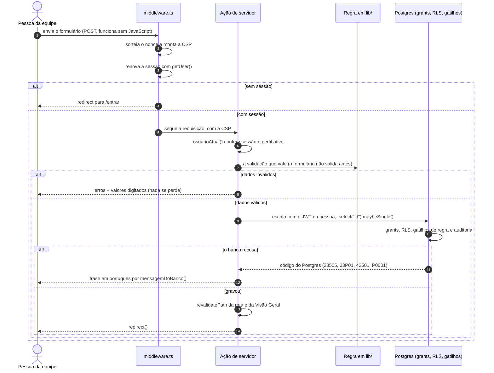
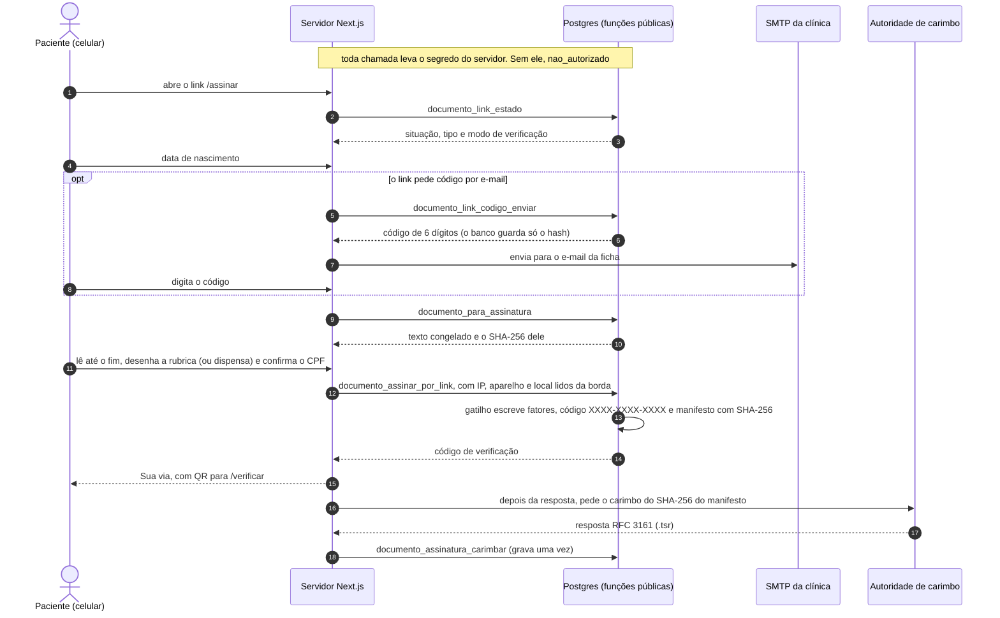
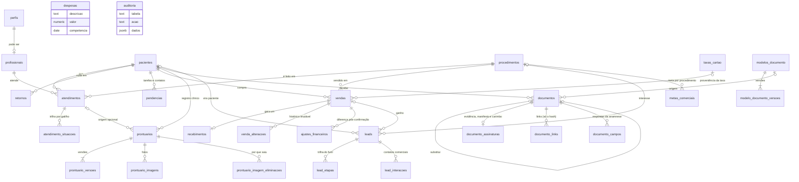

<p align="center">
  
</p>

<div align="center">

[](https://nextjs.org)
[](https://react.dev)
[](tsconfig.json)
[](src/app/globals.css)
[](supabase/README.md)
[](supabase/migrations)
[](vercel.json)

[](#testes)
[](supabase/testes/permissoes.sql)
[](e2e)
[](e2e/acessibilidade.spec.ts)
[](supabase/migrations)
[](#assinatura)
[](.github/workflows/ci.yml)
[](eslint.config.mjs)
[](#seguranca)
[](AGENTS.md)

**Agenda · Pacientes · Prontuários · Financeiro · Documentos e Contratos · Relacionamento · Captação · Assinatura com prova**<br>
O sistema de gestão do consultório de estética da **Dra. Érika Passos** — no lugar da agenda de papel,
do caderno, das conversas de WhatsApp e da planilha. Com o banco de dados como última linha de defesa.

</div>

<br>

<p align="center">
  
</p>
<p align="center"><sub>Telas reais do sistema, em movimento, com dados de demonstração.</sub></p>

<div align="center">

| Produto | Engenharia | Garantias | Operação |
|:--|:--|:--|:--|
| [Por que existe](#por-que) | [Arquitetura](#arquitetura) | [Segurança e LGPD](#seguranca) | [Rodando localmente](#rodar) |
| [Em números](#numeros) | [Banco de dados](#banco) | [Dinheiro sem erro de centavo](#dinheiro) | [Testes](#testes) |
| [Módulos](#modulos) | [Design](#design) | [Assinatura com prova](#assinatura) | [Implantação](#implantacao) |
| [Perfis e permissões](#perfis) | [A jornada](#jornada) | [O que o banco garante](#banco-garante) | [Documentação](#documentacao) · [Contribuindo](#contribuindo) |

</div>

> [!IMPORTANT]
> **Software real, para uma clínica real, com dado de saúde de pessoas reais.** Dado de paciente é dado
> pessoal sensível (LGPD, art. 5º, II): por isso a RLS está ligada em toda tabela, a chave `service_role`
> não existe na aplicação e nenhum registro se apaga pela API. A única exceção é a foto de evolução,
> a pedido da titular, e isso é garantido pelo próprio banco desde a migração 0019 (ver [Segurança](#seguranca)).
> Os dados de demonstração existem para mostrar o sistema cheio: ficam marcados no banco pela coluna
> `exemplo` e, enquanto houver uma paciente assim, a interface mostra uma faixa permanente de aviso.


<a id="por-que"></a>

## Por que existe

Um consultório pequeno vive espalhado: a agenda no papel, a ficha no caderno, a confirmação no WhatsApp e
o caixa na planilha. O Cockpit junta tudo em uma tela — o dia da clínica, o que precisa de atenção, quem
está no período de voltar e quem ainda nem é paciente — sem pedir que a equipe trabalhe mais para isso.

Seis princípios atravessam o código inteiro:

| Princípio | Na prática |
|---|---|
| **O banco decide** | Interface e servidor conferem, mas a última palavra é da RLS, dos grants e dos gatilhos do Postgres. Esconder o botão não é proteger a rota |
| **Centavo não se perde** | Todo cálculo de dinheiro em centavos inteiros e pontos-base, com um único arredondamento — e o banco confere de novo |
| **O relógio é o da clínica** | "Hoje" é o dia de São Paulo (`America/Sao_Paulo`), qualquer que seja o fuso do servidor |
| **Nada some sem rastro** | Sem DELETE pela API; corrigir é cancelar, ajustar, versionar ou arquivar — e a auditoria guarda quem mudou o quê |
| **Cor com significado** | Azul é a marca; vermelho, laranja, verde e azul informativo são estados — e estado nunca vem só na cor |
| **Tudo em português** | Interface, mensagens, funções, variáveis, colunas, migrações e commits |

<a id="numeros"></a>

## Em números



<details>
<summary><b>Todos os números</b> — contados no código em 26/09/2026, no commit <code>1764905</code></summary>

| Onde | Quanto |
|---|---|
| Páginas (`page.tsx`) | **51** — 44 autenticadas em `(app)` e 7 públicas: `/entrar`, `/recuperar-senha`, `/redefinir-senha`, `/sem-acesso`, `/assinar/[token]`, `/verificar` e `/verificar/[codigo]` |
| Componentes React | **124**, em 11 pastas |
| TypeScript em `src/` | ~**57,2 mil linhas** em 369 arquivos, testes incluídos (~43,7 mil em 277 sem eles; 2.297 são os tipos gerados do banco) |
| Migrações SQL | **32**, somando ~**10 mil linhas** (10.033); a maior é a 0032, com 1.285 |
| Tabelas | **30** — 29 em `public`, todas com RLS e só uma com DELETE (fotos, pela LGPD), mais `private.segredo_do_servidor` |
| Políticas de RLS | **72** (69 em `public` + 3 no Storage) |
| Gatilhos | **79** em `public`, dos quais **23** de auditoria |
| Funções no banco | **68** — 27 em `public` (21 chamadas pela aplicação e 6 de gatilho) e 41 em `private`; **7** alcançáveis por `anon`, todas exigindo o segredo do servidor |
| Verificações automatizadas | **1631** — 1004 Vitest · 302 SQL por perfil · 325 Playwright (272 Chromium, 48 WebKit, 5 iPhone 13) |
| Dependências | **9** de execução (entraram `nodemailer` e `qrcode`), 20 de desenvolvimento |
| Histórico | **486 commits** desde 01/08/2026 |

</details>


<a id="modulos"></a>

## Módulos


| Módulo | Rota | O que faz hoje | Estado |
|---|---|---|:-:|
| **Visão Geral** | `/` | Cabine do dia (quem está em atendimento, a próxima, os números do dia e do mês e a fila do dia com marcador "agora"), paleta de comandos, atalhos de teclado, pendências, retornos, caixa do mês e aniversários | Pronto |
| **Agenda** | `/agenda` | Marcar, remarcar e acompanhar o dia; sete situações com trilha gravada por gatilho; choque de horário recusado pelo banco | Pronto |
| **Pacientes** | `/pacientes` | Cadastro com CPF validado, busca sem acento, ficha com histórico, arquivamento e importação de planilha em dois passos | Pronto |
| **Prontuários** | `/prontuarios` | Registro clínico versionado e fotos de evolução em bucket privado — só a administradora | Pronto |
| **Financeiro** | `/financeiro` | Vendas, recebimentos, despesas, taxas de cartão, movimentações e fluxo mensal, com filtros na URL | Pronto |
| **Documentos e Contratos** | `/formularios` | Modelos versionados, texto congelado com SHA-256, anamnese e assinatura no balcão ou por link — **com prova**: código por e-mail, rubrica, código de verificação com QR, manifesto e carimbo de tempo RFC 3161 | Pronto |
| **Relacionamento** | `/relacionamento` | Confirmações dos próximos 15 dias, retornos, tarefas, aniversários e convites para avaliação no Google | Pronto |
| **Captação** | `/captacao` | Funil 3D vivo, meta do mês virando funil inverso, carteira de leads com contatos e retornos, conversão em paciente; agenda e venda movem o funil pelo banco | Pronto |
| **Busca global** | `/busca` | Pacientes, atendimentos, documentos e — para a administradora — prontuários, respeitando a RLS | Pronta |
| **Verificação pública** | `/verificar` | Qualquer pessoa confere a autenticidade de um documento assinado pelo código ou pelo QR da via, sem login e sem dado de saúde | Pronta |
| **Configurações** | `/configuracoes` | Procedimentos e Conferência das fotos; equipe, dados da clínica, horário e permissões ainda "em breve" | Parcial |
| **Relatórios** | `/relatorios` | Página provisória: navegável, descreve o que virá e avisa que está em construção | Provisória |

<details>
<summary><b>Visão Geral</b> — a cabine do dia</summary>

- **O agora**: quem está em atendimento, a próxima paciente (com "horário passou há N min"), atendimentos de hoje e recebido no mês.
- **A fila do dia** em cartões, com o marcador "agora" andando pelo relógio da clínica.
- **Painéis**: "Pede atenção" (pendências), Caixa do mês com os últimos seis meses, Aniversários do mês e Voltam em breve (retornos).
- **Em toda tela**: a barra de módulos, a faixa do agora, a paleta de comandos com <kbd>Ctrl</kbd>/<kbd>⌘</kbd>+<kbd>K</kbd> e os atalhos de uma tecla <kbd>N</kbd> <kbd>A</kbd> <kbd>V</kbd> <kbd>T</kbd> (nova paciente, agendamento, venda, tarefa), que dá para desligar (WCAG 2.1.4). No celular, navegação inferior.

</details>

<details>
<summary><b>Pacientes</b> — cadastro, busca e importação de planilha</summary>

- **Só o nome é obrigatório** (mínimo 3 caracteres). CPF, telefone, e-mail e nascimento são opcionais — e validados quando informados.
- CPF confere os dois dígitos verificadores e recusa sequências de um dígito só. **CPF repetido é recusado pelo índice único do banco**, não só pela tela.
- **Nome social tem precedência em toda a interface.** Observações são administrativas; conteúdo clínico vai para o prontuário.
- **Não existe excluir paciente.** Arquivar tira da lista, preserva tudo e é reversível no clique seguinte.
- **Ficha inexistente e ficha sem permissão devolvem a mesma tela** — dizer que o registro existe já é informação.
- Busca por nome, nome social, e-mail e telefone, **sem acento** (coluna gerada no banco); com 3 dígitos ou mais, a pontuação é ignorada e a busca procura também no CPF. Caracteres da gramática do PostgREST e curingas do `ilike` são retirados do termo.
- **Importação CSV** (só administradora): dois passos, nada gravado antes da confirmação; o arquivo é **reprocessado no servidor**; separador `;` detectado fora das aspas; UTF-8 estrito com queda para Windows-1252; `.xlsx` recusado; duplicata detectada por CPF; a mesma validação do cadastro manual; lotes de 100; até 2 MB e 2000 linhas; botão "Baixar modelo".

</details>

<details>
<summary><b>Agenda</b> — o dia na ordem do relógio</summary>

- Escolher o procedimento preenche duração e valor da tabela, editáveis caso a caso.
- O seletor de paciente **busca no servidor** e devolve até 8 opções — a base nunca desce inteira para o navegador. Funciona pelo teclado.
- **Choque de horário é recusado pelo banco** (migração 0021): o gatilho trava o profissional (`pg_advisory_xact_lock`) e compara o intervalo inteiro — duas recepcionistas marcando o mesmo horário no mesmo segundo não passam juntas.
- Sete situações: agendado · aguardando confirmação · confirmado · em atendimento · concluído · cancelado · não compareceu. Toda mudança entra em `atendimento_situacoes` por gatilho, com autor e hora.
- Filtro por profissional e navegação por dia, ambos na URL. Os botões de situação são `<form>` de verdade: funcionam sem JavaScript.

</details>

<details>
<summary><b>Prontuários e fotos de evolução</b> — o dado mais sensível do sistema</summary>

- Conteúdo clínico nunca é sobrescrito: alterar cria nova linha em `prontuario_versoes`, com motivo, autor e data — queixa e anamnese, avaliação, conduta, evolução, orientações e observações.
- Fotos em **bucket privado** (`prontuario-imagens`, até 10 MB cada, jpeg/png/webp, até 12 por envio), exibidas por URL assinada de **15 minutos** — nunca URL pública, e nada de `next/image` (o otimizador copiaria a foto para fora do bucket).
- **O arquivo não passa pela ação de servidor**: o navegador envia direto ao Storage, e o servidor relê tamanho e tipo do objeto (e o tipo pelos primeiros bytes) antes de gravar a linha. Desde a 0028, a linha só nasce se o arquivo existir no bucket.
- **Eliminar é a única exceção ao "não se apaga"** — pela LGPD (art. 18, VI), a pedido da titular, com motivo de pelo menos 10 caracteres guardado e o arquivo removido **antes** da linha, para nunca sobrar dado de saúde sem dono.
- **Conferência das fotos** (Configurações, só leitura): aponta registro sem arquivo e arquivo sem registro.

</details>

<details>
<summary><b>Financeiro</b> — do balcão ao fluxo do ano</summary>

- **Visão geral do mês**: total vendido, total recebido, taxas de cartão, a receber (com o vencido à parte), despesas pagas e pendentes e resultado de caixa. Para a recepção, o que depende de despesa aparece como "—" (`null`, nunca zero). Não existe indicador de lucro: a regra ainda não foi definida pela clínica.
- **Venda**: crédito em até 24x com repasse único (um recebimento); taxa da tabela ou manual com justificativa (só financeiro ou administradora, conferido também dentro de `venda_registrar`); "já recebido" para o pagamento no balcão; **um envio gera uma venda** — a tela manda uma chave única e o banco devolve a venda já criada num duplo clique.
- **Alterar forma de pagamento ou taxa** mostra o comparativo "Antes × novo cenário" e exige motivo. Recebimento ainda previsto é reescrito; confirmado não é tocado, e a diferença vira ajuste.
- **Recebimento** confirmado com valor e data ("recebido" ou "recebido com divergência", decidido pelo valor); **despesa** de pendente para paga ou cancelada, com "vencida" derivada; **taxas** mostram "aplicada em N vendas" e se desativam em vez de sumir; **fluxo mensal** de 12 meses com acumulado.

</details>

<details>
<summary><b>Captação</b> — do lead à venda, com contato e retorno</summary>

- **Funil 3D vivo**: desenhado em SVG com animação SMIL, sem biblioteca 3D, em quatro etapas (entrada → qualificado → agendamento → venda). Respeita `prefers-reduced-motion`, e cada estágio leva à carteira filtrada.
- **Lead não é paciente**: entra pela carteira com origem, campanha e procedimento de interesse; vira paciente por conversão (numa transação, idempotente) ou vínculo a um cadastro que já existe.
- **Meta vira plano**: gap → vendas → agendamentos → qualificados → leads, e o ritmo do mês — "projeção no ritmo atual", nunca previsão. Gargalo, origem e campanha, com receita atribuída por coorte. A meta por procedimento já existe no banco; a tela ainda não a oferece.
- **Venda concluída é evidência do Financeiro**: `ganho ⇔ venda_id`, garantido pelo banco; agenda e venda da paciente vinculada movem o lead por gatilho.
- **Carteira**: 15 por página, busca, filtros por etapa, origem e acompanhamento, WhatsApp direto, "parados" a partir de 3 dias e selos de retorno atrasado, de hoje e futuro. Cada contato registra canal, observação (até 1000 caracteres) e próximo retorno — só inserção, autor e hora do banco; lead encerrado perde o retorno e não recebe contato.
- **Coorte × carteira aberta**: funil, conversões e receita atribuída olham os leads que entraram no mês; os retornos olham a carteira aberta inteira. Tudo em [`docs/captacao.md`](docs/captacao.md).

</details>

<details>
<summary><b>Relacionamento e Busca</b></summary>

- **Relacionamento**: seis abas — visão, confirmações (próximos 15 dias, com "confirmar pela lista"), retornos com data escolhida pela equipe (o sistema **não** recomenda período clínico), aniversários, avaliações e tarefas. Convite para avaliação no Google e mensagem de aniversário com texto pronto para abrir no WhatsApp ou copiar; "Marcar como enviada" só depois de abrir ou copiar. O envio é manual, e o banco garante um registro por paciente, origem e dia.
- **Busca global**: formulário GET em `/busca?q=`, de 2 a 80 caracteres; pacientes (inclusive arquivadas), atendimentos (os 8 mais recentes, por paciente, procedimento ou data `dd/mm/aaaa` no fuso da clínica), documentos e, só para a administradora, prontuários. Nunca lê conteúdo clínico nem consolidado financeiro.

</details>

<a id="perfis"></a>

## Perfis e permissões

Três perfis, e cada regra de acesso é conferida em **três camadas**: a interface não oferece a porta, a ação de
servidor recusa com uma frase legível e a RLS do banco recusa mesmo que as outras duas sejam contornadas.
Algumas regras ficam de propósito só na aplicação — a importação de planilha restrita à administradora, a
data de pagamento de despesa que não pode estar no futuro, o tamanho mínimo do motivo —, e o [`AGENTS.md`](AGENTS.md) (§5, "Onde a
terceira camada não existe hoje") lista cada uma.

| O que | Recepção | Financeiro | Administradora |
|---|:-:|:-:|:-:|
| Pacientes, agenda, retornos e tarefas | ✓ | ✓ | ✓ |
| Registrar venda com a taxa padrão (e marcá-la "já recebida" quando pagou no balcão) | ✓ | ✓ | ✓ |
| Ver vendas, movimentações e os números de entrada do Financeiro | ✓ | ✓ | ✓ |
| Emitir e colher assinatura de contrato, termo e orientação | ✓ | ✓ | ✓ |
| Operar leads e registrar contatos comerciais | ✓ | só leitura | ✓ |
| Definir a meta comercial | só leitura | ✓ | ✓ |
| Confirmar recebimento depois · lançar e pagar despesa | — | ✓ | ✓ |
| Alterar forma de pagamento ou taxa (com motivo) | — | ✓ | ✓ |
| Despesas, resultado de caixa e fluxo mensal | — | ✓ | ✓ |
| Configurar a tabela de taxas de cartão | — | ver | ✓ |
| Importar planilha de pacientes | — | — | ✓ |
| Criar e versionar modelos de documento | — | — | ✓ |
| Prontuários, fotos de evolução, anamnese e Conferência das fotos | — | — | ✓ |
| Editar procedimentos | — | — | ✓ |

Conferir um documento em `/verificar` é aberto a **qualquer pessoa, sem login** — e não mostra dado de saúde.

Conta nova nasce **inativa** e como **recepção**, sempre — o papel não vem do metadado do cadastro (a
migração 0004 fechou essa escalada de privilégio). Liberar e promover são ações da administradora; auditoria
e gestão de usuários existem no banco, ainda sem tela.


<a id="arquitetura"></a>

## Arquitetura


| Camada | Tecnologia | Onde |
|---|---|---|
| Aplicação | Next.js 15 (App Router) · React 19 · TypeScript estrito · Tailwind CSS v4 · `lucide-react` | **Vercel**, região `gru1` (São Paulo), fixada no [`vercel.json`](vercel.json) |
| Banco e autenticação | Postgres + Auth + Storage do **Supabase** (`@supabase/ssr`) | A região escolhida na criação do projeto — recomendada `sa-east-1`, ao lado da Vercel; ela não muda depois |
| Serviços externos | Autoridades de carimbo de tempo RFC 3161 (DigiCert → Sectigo → FreeTSA) e o SMTP da clínica (`nodemailer`) | Só do servidor; nenhum dado de paciente sai para o carimbo, só um hash |
| Qualidade | Vitest + Testing Library · SQL de permissões por perfil · Playwright (Chromium, WebKit e iPhone 13) com axe | Supabase local em Docker — nada toca produção |

Poucas dependências, de propósito: o leitor de CSV foi escrito à mão porque nenhuma biblioteca resolve ao
mesmo tempo as três particularidades da planilha brasileira; o pedido e a leitura do carimbo RFC 3161 também,
sem biblioteca de ASN.1; a fonte (Hanken Grotesk) vem por `next/font`, sem requisição externa em tempo de
execução. As duas dependências que entraram com a assinatura com prova são `nodemailer` (código por e-mail)
e `qrcode` (QR da via).

### Uma requisição, de ponta a ponta


```mermaid
sequenceDiagram
    autonumber
    actor P as Pessoa da equipe
    participant M as middleware.ts
    participant A as Ação de servidor
    participant L as Regra em lib/
    participant B as Postgres (grants, RLS, gatilhos)
    P->>M: envia o formulário (POST, funciona sem JavaScript)
    M->>M: sorteia o nonce e monta a CSP
    M->>M: renova a sessão com getUser()
    alt sem sessão
        M-->>P: redirect para /entrar
    else com sessão
        M->>A: segue a requisição, com a CSP
        A->>A: usuarioAtual() confere sessão e perfil ativo
        A->>L: a validação que vale (o formulário não valida antes)
        alt dados inválidos
            A-->>P: erros + valores digitados (nada se perde)
        else dados válidos
            A->>B: escrita com o JWT da pessoa, .select("id").maybeSingle()
            B->>B: grants, RLS, gatilhos de regra e auditoria
            alt o banco recusa
                B-->>A: código do Postgres (23505, 23P01, 42501, P0001)
                A-->>P: frase em português por mensagemDoBanco()
            else gravou
                A->>A: revalidatePath da rota e da Visão Geral
                A-->>P: redirect()
            end
        end
    end
```

### As regras da casa

1. **Componente não conversa com o banco.** Leitura em `src/server/consultas/` (`server-only`), escrita em `src/server/acoes/` (`"use server"`).
2. **Toda ação abre com `usuarioAtual()`.** O layout protege a página, não o POST direto numa server action.
3. **A regra mora em `lib/`, e todo caminho de escrita passa por ela** — a ação chama `validarPaciente`, `calcularVenda`, `validarDespesa`; o formulário (`noValidate`) mostra os erros que ela devolve e usa de `lib/` só listas, rótulos e a conta da prévia.
4. **Estado de tela mora na URL**: busca, filtro, página, dia da agenda e mês do financeiro. Recarregar, voltar e mandar o link funcionam.
5. **Botão de ação é formulário de verdade** e devolve `ResultadoAcao`; a recusa aparece ao lado do botão.
6. **Toda escrita confere que alcançou uma linha** — RLS que esconde a linha não dá erro, dá zero linhas, e zero linhas não é sucesso.
7. **Erro de banco vira português** por `mensagemDoBanco()`; o detalhe técnico vai sanitizado para o log. Nada de `error.message` cru na tela.
8. **Nenhuma ação usa `try/catch`, e `redirect()` é a última linha**: valida → escreve → checa erro → `revalidatePath` → `redirect`.
9. **A RLS filtra em silêncio** — em soma sobre tabela restrita, "não posso ver" vira `null`, nunca zero.

<a id="seguranca"></a>

## Segurança e LGPD


> [!WARNING]
> **Banco e código mudam na mesma janela.** O código atual depende das 32 migrações: abaixo da 0025 caem a
> busca de pacientes e o Relacionamento, abaixo da 0028 toda venda nova dá `PGRST202`, e abaixo da 0032 as
> funções de assinatura não existem com o parâmetro do segredo. O inverso também quebra: a 0032 derruba as
> assinaturas antigas dessas funções, e o app anterior perde a assinatura. Sem o SHA-256 do segredo gravado
> no banco, toda assinatura responde `nao_autorizado`. O roteiro está em [`docs/implantacao.md`](docs/implantacao.md).

<a id="banco-garante"></a>

**O que o banco garante sozinho**, mesmo contra quem chama a API direto com a chave anônima:

- **Privilégio mínimo** (0019): cada tabela declara seus grants; o padrão não concede nada a `authenticated`; políticas separadas por operação, **sem DELETE** em lugar nenhum — exceto fotos de evolução, pela LGPD.
- **Dinheiro conferido na origem** (0020): a taxa de toda venda precisa vir da tabela padrão (ou ser manual, pelo financeiro) e o valor precisa bater com o arredondamento do sistema; recebimento confirmado não se reescreve.
- **Agenda sem choque** (0021): sobreposição recusada com `23P01`, sob trava por profissional.
- **Documento à prova da API** (0022): documento só nasce do texto do modelo e só muda de situação; hash, hora, canal e operador da assinatura são escritos pelo banco; pergunta da anamnese congela.
- **Venda só pela função** (0023): ninguém insere nem altera venda, histórico ou ajuste pela API; toda venda nasce com exatamente um recebimento; o recebimento previsto não diverge da venda; confirmação sem data futura e "recebido" só pelo líquido previsto.
- **Fotos sem troca de arquivo** (0024): a API só altera legenda, data, arquivamento e ordem; a administradora vê as sobras entre Storage e tabela (detecta, não apaga); `anon` não gera id de sequência nenhuma.
- **Contato estruturado** (0025): o Relacionamento reconhece registro de contato por coluna, não por texto, com um registro por paciente, origem e dia.
- **Marca de exemplo fora da API** (0026): com sessão, ninguém grava nem troca `exemplo = true` — o `dados:limpar` só apaga o que o seed marcou.
- **O banco escreve a evidência** (0027): versão de modelo na sequência, quem respondeu a anamnese e quando, autor e data da foto; a via diz o canal da assinatura.
- **Venda idempotente e foto só com arquivo** (0028): o mesmo envio do formulário de venda devolve a venda já criada, sem segunda venda nem segundo recebimento; a linha da foto só nasce se o objeto existir no bucket, com tipo e tamanho lidos do Storage.
- **Captação conferida** (0029–0031): `ganho ⇔ venda_id` por CHECK; conversão em paciente numa transação, idempotente; agenda e venda movem o lead por gatilho; contato comercial só de inserção e só em lead aberto; lead encerrado sem retorno; o resumo do último contato não volta no tempo.
- **Assinatura com prova** (0032): o segredo do servidor é conferido pelo banco em toda função pública e no balcão; fatores, código de verificação e manifesto são escritos por gatilho; a rubrica passa por regex; o carimbo de tempo é gravado uma vez; a assinatura é imutável.
- **Funções auxiliares no schema `private`**, fora do que o PostgREST publica; funções novas nascem com `search_path` fixo e sem `EXECUTE` para `anon`.
- **Auditoria por gatilho em 23 tabelas**: toda tabela editável com dado de paciente, de agenda, de dinheiro, de documento, de prontuário, de captação ou de acesso.

**Na borda:**

| Proteção | Como |
|---|---|
| Sessão | `getUser()` — que valida o token no servidor do Supabase — e nunca `getSession()`; o middleware renova a sessão a cada requisição; perfil inativo vai para `/sem-acesso` |
| Embutir em outro site | `Content-Security-Policy: frame-ancestors 'none'` + `X-Frame-Options: DENY` |
| Transporte | `Strict-Transport-Security` de 2 anos (`max-age=63072000`) e `Cross-Origin-Opener-Policy: same-origin`; sem `X-Powered-By` |
| Tipo de arquivo | `X-Content-Type-Options: nosniff` |
| Scripts e origens | CSP com nonce por requisição ([`src/lib/politica-de-conteudo.ts`](src/lib/politica-de-conteudo.ts), enviada pelo middleware); script só com nonce + `'strict-dynamic'`; `'unsafe-inline'` só no atributo `style` |
| Buscadores | `X-Robots-Tag: noindex, nofollow` em tudo |
| Token de assinatura | `Referrer-Policy: no-referrer`, `Cache-Control: no-store` e `noarchive` em `/assinar/*`; origem do link fixada por `ORIGEM_PUBLICA` |
| Segredo do servidor | Só a aplicação grava assinatura, IP e aparelho: a API direta, mesmo com a chave anônima, recebe `nao_autorizado` |
| Verificação pública | `/verificar` devolve situação, iniciais, fatores, hashes e carimbo — nunca título, nome completo, CPF ou texto |
| Login | redirecionamento pós-login só para caminho interno (`destinoSeguro`) |
| Log | uma linha JSON por falha (`"app":"cockpit"`, código, contexto e id de correlação), sanitizada (e-mail, token, CPF, telefone, data viram marcadores) — pronta para log drain |
| Recursos do aparelho | câmera, microfone, localização, pagamento e USB desligados por `Permissions-Policy` |
| Chave `service_role` | **não entra na aplicação** — nem `.env.local`, nem Vercel, nem navegador |

<a id="dinheiro"></a>

## Dinheiro que não erra centavo


- **Cartão parcelado, repasse único.** A paciente parcela, a operadora antecipa, a clínica recebe **uma vez** — uma venda em 5x gera **um** recebimento.
- **A taxa é da clínica, não da paciente**: desconta do valor final, nunca acrescenta — e **nunca vira despesa** (contar de novo dobraria o custo).
- **A taxa é copiada na venda.** Mudar a tabela padrão amanhã não muda o que já foi vendido. Taxa manual exige justificativa e não toca a tabela.
- **Gravação composta é função do banco**: `venda_registrar` e `venda_alterar_pagamento` fazem tudo ou nada.
- **Confirmado não se reescreve**: mudança depois da confirmação vira linha em `ajustes_financeiros`; toda alteração entra em `venda_alteracoes`, com motivo, autor e hora.
- **"Vencida" é derivada**, nunca gravada — estado gravado envelheceria errado à meia-noite.
- **Soma sem corte silencioso**: toda soma passa por `somaEmCentavos`, e a leitura em blocos evita o limite de 1000 linhas do PostgREST.

```text
taxa (centavos)    = round(valor_final × pontos_base ÷ 10000)      6,5% = 650 pontos-base
valor_original − desconto   = valor_final                           ← CHECK no banco
valor_final    − taxa_valor = valor_liquido                         ← CHECK no banco
resultado de caixa = líquido recebido − despesas pagas              (lucro não entra: regra ainda não definida)
```


<a id="assinatura"></a>

## Documentos e assinatura com prova


Assinatura eletrônica **simples** (Lei 14.063/2020), sem ICP-Brasil — mas com cada circunstância reforçada
pelo banco e **verificável fora do sistema**.

| Evidência | Quem garante |
|---|---|
| Segredo do servidor | `private.servidor_confere`, em toda função pública e no balcão; o banco guarda só o SHA-256 |
| Posse do link | Token de 256 bits, guardado só como SHA-256 — nem o sistema remonta o link depois |
| Data de nascimento | Conferida pelo banco; dez erros seguidos fecham o link (linha travada com `for update`) |
| Código por e-mail | 6 dígitos, só o hash no banco; 15 min para digitar, 60 min de validade depois de conferido, reenvio a cada 45 s |
| CPF | Igual ao da ficha vira fator; diferente é recusado (`cpf_nao_confere`) |
| Rubrica | Desenhada em canvas (dedo, caneta ou mouse); o traço passa por regex no banco, nunca SVG livre; "Prefiro não desenhar" é a alternativa acessível, e fica registrada |
| Leitura | Tempo com o texto aberto e rolagem até o fim, informados pelo navegador — e o manifesto diz isso |
| Fatores, código e manifesto | Gatilho `documento_assinaturas_manifesto`: código `XXXX-XXXX-XXXX` (sem I, O, 0 e 1; 60 bits) e o texto canônico com SHA-256 |
| Carimbo de tempo | RFC 3161, pedido a DigiCert → Sectigo → FreeTSA depois da resposta, gravado **uma vez** |
| Imutabilidade | Gatilho `documento_assinaturas_imutavel`: só as colunas do carimbo, uma vez |

- **Quem congela o texto é o banco.** `documento_emitir` lê o corpo da versão vigente do modelo dentro da própria função e o gatilho calcula o SHA-256 — se o texto viesse por parâmetro, o hash atestaria qualquer coisa. Correção gera documento novo, que referencia o anterior.
- **Dois caminhos, e o registro diz qual**: no **balcão** (conferência presencial, rubrica na tela da clínica ou "assinar só pelo nome", CPF opcional, sem desfazer) ou por **link** (posse do link + data de nascimento + código por e-mail quando o link pede + CPF conferido). IP, aparelho e local vêm dos cabeçalhos da borda, nunca do formulário.
- **`anon` alcança sete funções e nenhuma tabela** — `documento_link_estado`, `documento_link_codigo_enviar`, `documento_para_assinatura`, `documento_assinar_por_link`, `documento_responder_por_link`, `documento_assinatura_carimbar` e `documento_verificar` —, todas exigindo o segredo do servidor.
- **A paciente anda em etapas**: Identidade → Código (quando o link pede) → Leitura (ou "Preencher", na anamnese) → Assinatura → Sua via. A via sai em PDF pela impressão do navegador, com rubrica, fatores, hashes, carimbo e QR; o link segue valendo até o vencimento (7, 15 ou 30 dias), e só um link fica vivo por documento.
- **Na ficha do documento**, "Evidências da assinatura" mostra tudo, oferece "Carimbar agora" quando a autoridade não respondeu e baixa o manifesto (`.txt`) e o carimbo (`.tsr`) pela sessão.
- **Anamnese** com sete tipos de campo (texto, texto longo, sim/não, escolha única, escolha múltipla, data, número): **a pergunta congela, a resposta vive** — e cada mudança fica na auditoria.


```mermaid
sequenceDiagram
    autonumber
    actor Pa as Paciente (celular)
    participant S as Servidor Next.js
    participant B as Postgres (funções públicas)
    participant E as SMTP da clínica
    participant T as Autoridade de carimbo
    Note over S,B: toda chamada leva o segredo do servidor. Sem ele, nao_autorizado
    Pa->>S: abre o link /assinar
    S->>B: documento_link_estado
    B-->>S: situação, tipo e modo de verificação
    Pa->>S: data de nascimento
    opt o link pede código por e-mail
        S->>B: documento_link_codigo_enviar
        B-->>S: código de 6 dígitos (o banco guarda só o hash)
        S->>E: envia para o e-mail da ficha
        Pa->>S: digita o código
    end
    S->>B: documento_para_assinatura
    B-->>S: texto congelado e o SHA-256 dele
    Pa->>S: lê até o fim, desenha a rubrica (ou dispensa) e confirma o CPF
    S->>B: documento_assinar_por_link, com IP, aparelho e local lidos da borda
    B->>B: gatilho escreve fatores, código XXXX-XXXX-XXXX e manifesto com SHA-256
    B-->>S: código de verificação
    S-->>Pa: Sua via, com QR para /verificar
    S->>T: depois da resposta, pede o carimbo do SHA-256 do manifesto
    T-->>S: resposta RFC 3161 (.tsr)
    S->>B: documento_assinatura_carimbar (grava uma vez)
```

**Conferir fora do sistema**, com o manifesto e o carimbo baixados da ficha:

```bash
sha256sum manifesto.txt                    # deve dar o "Registro (SHA-256)" da via
openssl ts -reply -in carimbo.tsr -text    # a autoridade, a hora e o mesmo hash carimbado
```

<a id="design"></a>

## Design


Estrutura, tipografia e espaçamento vêm de um mockup do Google Stitch (`docs/redesign`) — **a paleta não**:
o verde do mockup passou a significar "deu certo" e não podia continuar sendo a cor do menu. Todo token de
cor, raio e sombra mora em [`src/app/globals.css`](src/app/globals.css); todo par texto/fundo dos tokens passa
no WCAG AA (o texto terciário `--color-outline` foi escurecido e dá 4,74:1 no pior fundo — [`AGENTS.md`](AGENTS.md) §7.4);
foco sempre visível; atalho "Ir para o conteúdo"; `prefers-reduced-motion` respeitado, inclusive no funil 3D;
botão indisponível fica visível, com a razão no `title`. **44 endereços** (37 telas do sistema, com a 404
logada, e 7 públicas) são testados sem rolagem horizontal em 320, 768 e 1440 px e auditados pelo axe
(WCAG 2.0, 2.1 e 2.2, A e AA) em 360 e 1440 px — e a assinatura, etapa por etapa.


<a id="banco"></a>

## Banco de dados

Postgres gerenciado pelo Supabase. **Toda alteração de estrutura passa por uma migração versionada** em
[`supabase/migrations/`](supabase/migrations) — nada é alterado pelo painel. Migração aplicada é imutável:
correção vira arquivo novo.


```mermaid
erDiagram
    perfis ||--o| profissionais : "pode ser"
    pacientes ||--o{ atendimentos : "tem"
    profissionais ||--o{ atendimentos : "atende"
    procedimentos ||--o{ atendimentos : "é feito em"
    atendimentos ||--o{ atendimento_situacoes : "trilha por gatilho"
    pacientes ||--o{ retornos : "volta em"
    pacientes ||--o{ pendencias : "tarefas e contatos"
    pacientes ||--o{ vendas : "compra"
    procedimentos ||--o{ vendas : "vendido em"
    taxas_cartao |o--o{ vendas : "proveniência da taxa"
    vendas ||--o| recebimentos : "gera um"
    vendas ||--o{ venda_alteracoes : "histórico imutável"
    vendas ||--o{ ajustes_financeiros : "diferença pós-confirmação"
    pacientes ||--o{ prontuarios : "registro clínico"
    atendimentos |o--o{ prontuarios : "origem opcional"
    prontuarios ||--|{ prontuario_versoes : "versões"
    prontuarios ||--o{ prontuario_imagens : "fotos"
    prontuarios ||--o{ prontuario_imagem_eliminacoes : "por que saiu"
    modelos_documento ||--|{ modelo_documento_versoes : "versões"
    modelos_documento |o--o{ documentos : "origem"
    pacientes ||--o{ documentos : "recebe"
    documentos |o--o| documentos : "substitui"
    documentos ||--o| documento_assinaturas : "evidência, manifesto e carimbo"
    documentos ||--o{ documento_links : "links (só o hash)"
    documentos ||--o{ documento_campos : "respostas da anamnese"
    pacientes |o--o{ leads : "vira paciente"
    procedimentos |o--o{ leads : "interesse"
    vendas |o--o{ leads : "ganho"
    leads ||--o{ lead_etapas : "trilha do funil"
    leads ||--o{ lead_interacoes : "contatos comerciais"
    procedimentos |o--o{ metas_comerciais : "meta por procedimento"
    despesas {
        text descricao
        numeric valor
        date competencia
    }
    auditoria {
        text tabela
        text acao
        jsonb dados
    }
```

<details>
<summary><b>As 32 migrações</b>, da fundação à assinatura com prova</summary>

| Arquivo | O que faz |
|---|---|
| `0001_fundacao.sql` | Núcleo: perfis, equipe, procedimentos, pacientes, agenda, relacionamento, financeiro básico e auditoria. RLS ligada em tudo |
| `0002_endurece_funcoes.sql` | `search_path` fixo nas funções; funções de gatilho fora da API pública |
| `0003_funcoes_em_schema_privado.sql` | Funções auxiliares das políticas no schema `private` |
| `0004_cadastro_nao_concede_acesso.sql` | Perfil novo nasce inativo e como recepção; o papel deixa de vir do metadado do cadastro |
| `0005_marca_dados_de_exemplo.sql` | Coluna `exemplo` nas tabelas de conteúdo |
| `0006_financeiro_enums.sql` | Enums do Financeiro (numa migração própria: o Postgres não usa valor novo de enum na mesma transação) |
| `0007_financeiro_fundacao.sql` | Vendas, taxas de cartão, histórico de alterações e ajustes; a conta fecha por CHECK |
| `0008_operacoes_de_venda.sql` | `venda_registrar` e `venda_alterar_pagamento`: tudo ou nada |
| `0009_anon_fora_das_tabelas_novas.sql` | `anon` revogado das tabelas novas e do padrão das futuras |
| `0010_prontuarios.sql` | Prontuários versionados, restritos à administradora |
| `0011_prontuario_imagens.sql` | Fotos de evolução: bucket privado, metadados e as primeiras políticas de Storage |
| `0012_eliminacao_de_imagem.sql` | O motivo da eliminação e a função que registra e apaga na mesma transação |
| `0013_documentos.sql` | Modelos versionados, texto congelado com hash e a trilha da assinatura |
| `0014_assinatura_por_link.sql` | Assinatura à distância — a primeira superfície anônima: três funções, nenhuma tabela |
| `0015_canal_do_link.sql` | `grant update` de coluna em `canal_envio`: o canal é gravado no clique do envio |
| `0016_via_da_paciente.sql` | Assinar deixa de revogar o link; a paciente guarda a via do que assinou |
| `0017_anamnese.sql` | Anamnese: perguntas versionadas no modelo, respostas em `documento_campos` |
| `0018_emissao_grava_perguntas.sql` | As perguntas entram só por `private.documento_campos_criar` |
| `0019_privilegio_minimo.sql` | Grants declarados, uma política por operação, sem DELETE, auditoria ampliada |
| `0020_financeiro_conferido_no_banco.sql` | Origem da taxa conferida por gatilho; recebimento confirmado imutável |
| `0021_agenda_sem_choque.sql` | Choque de horário recusado pelo banco, com trava por profissional |
| `0022_documentos_integridade.sql` | Documento só nasce do modelo e só muda de situação; evidência escrita pelo banco |
| `0023_venda_so_pela_funcao.sql` | Venda, histórico e ajuste só pelas funções (agora `SECURITY DEFINER`); recebimento com UPDATE por coluna e confirmação coerente |
| `0024_fotos_reconciliacao_e_arestas.sql` | Reconciliação das fotos (só leitura); UPDATE por coluna nas fotos; sequências sem `anon` |
| `0025_contato_estruturado_e_arestas.sql` | `pendencias.origem` no lugar do texto; busca sem acento; teto do título do prontuário |
| `0026_marca_de_exemplo_e_privilegios.sql` | A marca de dado de exemplo não se grava pela API; sequência nova só com USAGE |
| `0027_banco_escreve_a_evidencia.sql` | Versão de modelo, autor da resposta e autor e data da foto escritos pelo banco; a via diz o canal da assinatura; recebimento sem taxa maior que o valor |
| `0028_venda_idempotente_e_foto_do_arquivo.sql` | Venda idempotente pela chave do envio (`vendas.chave_envio`, `p_chave` em `venda_registrar`); foto só com o objeto no bucket, tipo e tamanho do Storage |
| `0029_captacao_e_metas.sql` | Captação: leads, trilha de etapas por gatilho, metas comerciais; `ganho ⇔ venda_id`; conversão em paciente idempotente; agenda e venda movem o funil |
| `0030_contatos_comerciais.sql` | Contato comercial só de inserção e o resumo de último contato e próximo retorno no lead, escrito por gatilho |
| `0031_acompanhamento_comercial_conferido.sql` | Lead encerrado sem retorno; contato conferido (trava, lead aberto, retorno não no passado); resumo que não volta no tempo; contato na auditoria |
| `0032_assinatura_com_prova.sql` | Segredo do servidor (`private.segredo_do_servidor`, só o SHA-256; sem ele, `nao_autorizado`); código por e-mail; rubrica ou dispensa; tempo de leitura; CPF conferido; fatores, código de verificação e manifesto por gatilho; carimbo RFC 3161 gravado uma vez; assinatura imutável; `documento_verificar` público. Sete funções para `anon` |

O detalhe de cada uma está em [`supabase/README.md`](supabase/README.md) e no [`AGENTS.md`](AGENTS.md) §4.

</details>


<a id="rodar"></a>

## Rodando localmente

> [!NOTE]
> Precisa de **Node 22+** (o `@supabase/supabase-js` 2.117 declara `engines: node >=22`; com Node 20 o `npm ci`
> avisa `EBADENGINE`) e **Docker** (para o Supabase local, com Postgres 17). Nada aqui toca o banco de produção.

```bash
npm ci
npx supabase start          # Postgres local: aplica as 32 migrações e os dados de exemplo
npm run local:usuarios      # contas de teste (administradora, financeiro e recepção) e o hash do segredo de desenvolvimento
cp .env.local.example .env.local
npm run dev                 # http://localhost:3000
```

No `.env.local`, use a URL e a chave anônima que o `supabase start` imprime:

```dotenv
NEXT_PUBLIC_SUPABASE_URL=http://127.0.0.1:55321
NEXT_PUBLIC_SUPABASE_ANON_KEY=<chave anônima local impressa pelo supabase start>
ASSINATURA_SEGREDO_SERVIDOR=<segredoDoServidor de supabase/usuarios-locais.json>
EMAIL_PASTA=e2e/.emails
# opcional: ORIGEM_PUBLICA=http://localhost:3000
```

- **Sem as duas primeiras, a aplicação não sobe** — de propósito.
- **Sem `ASSINATURA_SEGREDO_SERVIDOR`**, ela sobe, mas nenhum documento se assina: o `local:usuarios` grava no banco o SHA-256 do segredo (o do ambiente ou, na falta dele, o `segredoDoServidor` de [`supabase/usuarios-locais.json`](supabase/usuarios-locais.json)), e os dois precisam bater.
- **Com `EMAIL_PASTA`**, cada e-mail vira um JSON na pasta, em vez de ser enviado — é de lá que o E2E lê o código da assinatura. `SMTP_URL` e `SMTP_REMETENTE` são para produção.

As contas e a senha de teste estão em [`supabase/usuarios-locais.json`](supabase/usuarios-locais.json) — só
existem no banco local. O Studio local abre em <http://127.0.0.1:55323>, e os e-mails do Auth (recuperação de
senha) caem em <http://127.0.0.1:55324>. As portas são 5532x, e não as 5432x padrão, porque o Windows reserva a
faixa 54286–54385 para o Hyper-V.

> [!WARNING]
> `npm run db:push`, `db:tipos`, `dados:exemplo` e `dados:limpar` usam `--linked` e falam **direto com o
> projeto vinculado** — em produção, o banco da clínica. Confirme com o dono do projeto antes de rodar
> qualquer um (ver [`AGENTS.md`](AGENTS.md) §2 e [`docs/implantacao.md`](docs/implantacao.md)).

> [!CAUTION]
> **Não rode `npm run build` com o `npm run dev` no ar.** Os dois escrevem na mesma pasta `.next`: a página abre
> sem CSS nenhum e algumas rotas dão 500. Conserto: pare o dev, apague `.next`, suba de novo e recarregue com Ctrl+Shift+R.

<a id="testes"></a>

## Testes

Três camadas, **1631 verificações automatizadas** — e nenhuma toca produção.

| Camada | Comando | Quanto | O que confere |
|---|---|---|---|
| Unidade e componente | `npm test` | **1004 testes** em 97 arquivos | Dinheiro, datas no fuso da clínica, CPF, CSV, erros do banco, login e redirecionamento, middleware, cabeçalhos de segurança, carimbo RFC 3161, rubrica, as ações de servidor contra um Supabase falso e os componentes (jsdom + Testing Library) |
| Banco | `npm run test:banco` | **302 asserções**, verdes do zero (migrações + seed) | RLS, grants e gatilhos **por perfil**, trocando de papel como a API troca — numa transação desfeita no fim |
| Navegador | `npm run test:e2e` | **325 testes**: Chromium 272 (48 de fluxo + 135 de telas: 44 endereços × 3 larguras + 3 + 89 de acessibilidade: 44 endereços × 2 larguras + a assinatura etapa por etapa), WebKit 48, iPhone 13 5 | Login e redirecionamento seguro, permissões por perfil pela URL, paciente, agenda, venda, despesa, prontuário, fotos, importação, Relacionamento, procedimentos, busca, 404, CSP, Captação de ponta a ponta e a **assinatura com código por e-mail** (lido de `EMAIL_PASTA`), também no WebKit e no iPhone; 44 endereços em 320, 768 e 1440 px, sem rolagem horizontal nem erro de console, e sem violação WCAG 2.2 A/AA (axe) em 360 e 1440 px, inclusive `/verificar` |

Os dois últimos precisam do Supabase local no ar com as contas de teste; o E2E recusa rodar se o `.env.local`
não apontar para `127.0.0.1`. Na primeira vez: `npx playwright install chromium webkit`. Um projeto só:
`npx playwright test --project=webkit`.

**Antes de dar qualquer trabalho por concluído:** `npm run lint`, `npm run typecheck` e `npm test` limpos —
mudou banco ou permissão, `npm run test:banco` também; mexeu em tela ou fluxo, `npm run test:e2e`.

**CI de 26/09/2026** (commit `1764905`), os quatro jobs verdes: Qualidade em 55 s (lint, tipos e Vitest
1004/1004) · Build em 1 min 25 s · Banco em 2 min 38 s (as 32 migrações e o seed do zero, `test:banco` 302/302
e os tipos gerados batendo com as migrações) · E2E em 20 min 33 s sobre o build de produção: 324 verdes e
1 pulado de propósito (axe e refluxo da carteira da Captação rodam só no Chromium).

> [!NOTE]
> **CI em [`.github/workflows/ci.yml`](.github/workflows/ci.yml)**: qualidade (lint, tipos, Vitest), banco
> (migrações, seed, `test:banco` e tipos conferidos num Supabase local dentro do runner), E2E (Chromium, WebKit
> e iPhone sobre o build de produção) e build. Nenhum job usa banco real nem segredo da clínica. Roda em pull
> request, em push no `main` e à mão. Com push direto no `main`, a CI avisa mas não barra; barrar exige branch
> curta e pull request com os quatro checks (ver [`AGENTS.md`](AGENTS.md) §2). Custo em repositório privado e os
> mesmos gates na sua máquina: [`docs/implantacao.md`](docs/implantacao.md#d-ci-custo-em-repositório-privado-e-os-mesmos-gates-na-sua-máquina).
> Os números deste README são a contagem de 26/09/2026, não um selo de build.

**Desempenho** ([`scripts/desempenho.mjs`](scripts/desempenho.mjs), medido num `next start` de cópia em 23/09/2026 —
antes da rubrica e do QR da 0032, então vale remedir `/assinar/[token]`): First Load JS compartilhado de 102–103 kB
e a maior parte das rotas entre 103 e 121 kB. O orçamento reprova acima de 110 kB compartilhado e 130 kB por rota,
com duas exceções — `/redefinir-senha` (190 kB, o cliente do Supabase no navegador) e `/captacao` (135 kB, a camada
de botões do funil 3D; mediu 131 kB em 25/09) — e TTFB p95 acima de 150 ms nas telas públicas e 1,5 s nas internas,
com 200 requisições e 10 simultâneas no Supabase local. O gargalo medido é o `getUser()` do Auth, feito duas vezes
por tela interna (ver [`AGENTS.md`](AGENTS.md) §2 e §10).

<details>
<summary><b>Todos os comandos</b></summary>

| Comando | O que faz |
|---|---|
| `npm run dev` | Servidor de desenvolvimento |
| `npm run build` · `npm start` | Build de produção e servidor do build (nunca com o `dev` no ar) |
| `npm run lint` | ESLint, com zero aviso tolerado |
| `npm run typecheck` | `tsc --noEmit` |
| `npm test` · `npm run test:watch` | Vitest, uma vez ou em modo observação |
| `npm run test:banco` | `supabase/testes/permissoes.sql` no Supabase local |
| `npm run test:e2e` | Playwright contra o Supabase local |
| `npm run local:usuarios` | Cria ou confere as contas de teste locais e grava o SHA-256 do segredo de desenvolvimento em `private.segredo_do_servidor` |
| `npm run db:tipos:local` | Regenera `src/lib/supabase/tipos-banco.ts` a partir do banco local |
| `npm run marca:gerar` | Favicon, ícone do iPhone e prévia de link a partir da logo ([`scripts/gerar-marca.mjs`](scripts/gerar-marca.mjs)) |
| `node scripts/desempenho.mjs orcamento <build.log>` · `carga` | Orçamento de First Load JS sobre a saída do `next build` · carga com TTFB p50/p95 contra um `next start` (nunca contra o `dev`) |
| `npx vercel` | CLI da Vercel sob demanda — não é dependência do projeto; deploy e variáveis são do dono |
| `npm run db:push` · `db:tipos` | **Projeto vinculado (produção):** aplica migrações e regenera os tipos — só o dono do projeto |
| `npm run dados:exemplo` · `dados:limpar` | **Projeto vinculado (produção):** semeia ou apaga só o que tem `exemplo = true` |

</details>

<details>
<summary><b>Estrutura de pastas</b></summary>

```text
src/
  middleware.ts              nonce + CSP, renova a sessão e barra rota protegida
  app/
    (app)/                   tudo que exige sessão: Visão Geral, agenda, pacientes, prontuarios,
                             financeiro, formularios (documentos), relacionamento, captacao,
                             busca, relatorios e configuracoes — com loading.tsx e error.tsx próprios
      formularios/[id]/prova/[arquivo]/   baixa o manifesto (.txt) e o carimbo (.tsr), pela sessão
    assinar/[token]/         a única rota pública que serve conteúdo de paciente
    verificar/  verificar/[codigo]/       conferência pública de autenticidade, sem dado de saúde
    entrar/  recuperar-senha/  redefinir-senha/  sem-acesso/
    globals.css              todos os tokens de cor, tipografia, raio e sombra
  components/
    ui/  layout/  overview/  e uma pasta por módulo (pacientes, agenda, financeiro, prontuarios,
                             documentos, relacionamento, captacao, configuracoes)
  server/
    consultas/               LEITURA — server-only, uma função por assunto
    acoes/                   ESCRITA — "use server", validação de verdade
    assinatura/              segredo do servidor, carimbo de tempo e QR (fora do "use server", de propósito)
    email.ts                 SMTP (nodemailer) ou, em desenvolvimento, a pasta de e-mails
  lib/                       regras compartilhadas: moeda, datas, CPF, CSV, venda, documento, captação…
    assinatura/              carimbo RFC 3161, evidência da requisição e rubrica
supabase/
  migrations/                0001 → 0032: a estrutura inteira do banco
  testes/permissoes.sql      as asserções do banco por perfil
testes/                      preparação do Vitest e o Supabase falso das ações
e2e/                         Playwright: fluxos, telas, acessibilidade, assinatura e segurança
scripts/                     contas locais, testes do banco, geração segura de tipos, marca, desempenho
docs/                        produto, captação, implantação, onboarding de agente, mockup e as artes deste README
```

</details>

<a id="implantacao"></a>

## Implantação

O guia completo está em **[`docs/implantacao.md`](docs/implantacao.md)**: projeto novo do zero (Supabase + Vercel),
atualização de um banco antigo, a tabela de variáveis de ambiente, o que no repositório aponta para a
infraestrutura de outro projeto e o custo da CI em repositório privado.

| Variável | Obrigatória? | Para quê |
|---|---|---|
| `NEXT_PUBLIC_SUPABASE_URL` · `NEXT_PUBLIC_SUPABASE_ANON_KEY` | Sim | Sem elas a aplicação não sobe |
| `ASSINATURA_SEGREDO_SERVIDOR` | Sim, para assinar | O banco confere o SHA-256 dele em toda assinatura |
| `ORIGEM_PUBLICA` | Sim, em produção, para o link | Origem do link que vai para a paciente |
| `SMTP_URL` + `SMTP_REMETENTE` | Opcionais (as duas juntas) | Código de 6 dígitos por e-mail |
| `EMAIL_PASTA` | Só desenvolvimento e testes | E-mails viram JSON numa pasta |

<details>
<summary><b>Resumo: atualizar um banco que parou na 0018</b></summary>

1. **Congele o deploy** automático e faça **backup** (PITR ou manual).
2. `npx supabase link --project-ref <SEU_REF>` e `npx supabase migration list`: o remoto precisa mostrar exatamente `0001` a `0018`.
3. **Pré-conferência**: as duas consultas da 0025 (contato repetido no dia e título de prontuário acima de 160) precisam voltar vazias. Se não voltarem, a clínica decide — nada de corrigir por script.
4. `npx supabase db push --dry-run` e `npm run db:push` (0019 → 0032).
5. **Segredo**: gere um valor novo, grave o SHA-256 em `private.segredo_do_servidor` e guarde o valor como `ASSINATURA_SEGREDO_SERVIDOR` na Vercel.
6. `npm run db:tipos` (diff vazio) e as conferências SQL: 7 funções para `anon`, toda assinatura antiga com código de verificação, o hash certo.
7. Vercel: `ORIGEM_PUBLICA` e, se houver, `SMTP_URL` + `SMTP_REMETENTE`. Auth: cadastro público desligado e `https://<domínio>/redefinir-senha` nas URLs de redirecionamento.
8. **Deploy** do código na mesma janela, religue o deploy automático e repita o backfill de `pendencias.origem` se o app antigo ficou no ar.
9. Valide: venda, busca sem acento, recebimento, fotos, e uma assinatura por link até `/verificar`.

</details>

<a id="jornada"></a>

## A jornada até aqui


| Quando | Marco |
|---|---|
| 01/08/2026 | Etapa 1: estrutura navegável e Visão Geral |
| 23/09/2026 | Auditoria de ponta a ponta e endurecimento do banco (0023–0028); o primeiro deploy com as 28 migrações; a nova linguagem visual |
| 24/09/2026 | Captação: leads, funil, metas comerciais e conversão (0029–0030) |
| 25/09/2026 | Acompanhamento comercial conferido (0031), marca da clínica em toda tela, "Cockpit vivo" com WhatsApp direto, funil 3D e o padrão visual em todas as telas |
| 26/09/2026 | Assinatura com prova (0032): segredo do servidor, código por e-mail, rubrica, carimbo de tempo e verificação pública |

**Próximos passos** (sem data, e sem inventar regra): Relatórios de verdade · perfil Profissional ·
o resto de Configurações (clínica, equipe, horário, permissões) · meta por procedimento na tela da Captação
(o banco já aceita) · PDF montado pelo sistema · **migração para o Next >= 16.3.0**: `middleware.ts` vira
`proxy.ts`, ESLint flat nativo (com 7 avisos `react-hooks/set-state-in-effect` a tratar), Turbopack no build,
orçamento de bundle de `scripts/desempenho.mjs` revisto — e sai a correção local do React descrita abaixo
(`AGENTS.md` §13).

> [!NOTE]
> **A tela que não se atualizava no build de produção do Chromium está corrigida.** Causa provada: o
> `react-dom` empacotado no Next 15.5.x perdia o "ping" de um dado que chegava no meio do render de uma
> transição suspensa (`router.refresh()` ou revalidação de ação), e a tela ficava na versão anterior.
> [`scripts/corrigir-ping-react.mjs`](scripts/corrigir-ping-react.mjs) aplica a linha que o Next 16.3.0 já traz,
> no `postinstall` (CI e Vercel), e [`testes/react-ping.test.ts`](testes/react-ping.test.ts) reprova sem ela.

**Decisões que dependem da clínica** — pergunte, não invente: regra de lucro · períodos de retorno por
procedimento · o que conta como "atendimento do dia" · canal de contato preferencial · horário de
funcionamento · se as sete situações cobrem a rotina · como corrigir uma confirmação de recebimento digitada errado ·
o destino de arquivo de foto sem registro · data de venda no futuro · coletor e retenção dos logs · **qual SMTP
envia o código da assinatura**. A lista completa, com o motivo de cada uma, está no [`AGENTS.md`](AGENTS.md) §10.

**Fora de escopo hoje:** integração com Google Calendar ou WhatsApp · envio de e-mails (exceto o código de
verificação da assinatura) · nota fiscal · processamento de pagamentos · automações · inteligência artificial ·
**qualquer recomendação clínica automática**.

<a id="documentacao"></a>

## Documentação

| Arquivo | Para quê |
|---|---|
| [`AGENTS.md`](AGENTS.md) | **Documento-chave.** Regras de negócio, hospedagem, banco, permissões, arquitetura, invariantes e dívidas conhecidas. Leitura obrigatória antes de mexer no código |
| [`docs/implantacao.md`](docs/implantacao.md) | Implantar e atualizar: projeto novo, atualização a partir da 0018, variáveis, o que trocar no repositório e custo da CI |
| [`docs/overview-sistema.md`](docs/overview-sistema.md) | Produto: cada módulo em detalhe, decisões de design e o que ainda é provisório |
| [`docs/captacao.md`](docs/captacao.md) | Captação: funil, meta financeira, acompanhamento dos leads e o funil 3D |
| [`supabase/README.md`](supabase/README.md) | Banco: migrações, banco local, roteiros de aplicação, criação de usuário e recuperação de senha |
| [`.env.local.example`](.env.local.example) | Modelo comentado de todas as variáveis de ambiente |
| [`docs/prompt-onboarding-codex.md`](docs/prompt-onboarding-codex.md) | Prompt pronto para um agente de IA novo ler, provar que entendeu e só então mexer |
| [`CLAUDE.md`](CLAUDE.md) | Só aponta para o `AGENTS.md` — para Claude e Codex lerem a mesma fonte |

<a id="contribuindo"></a>

## Contribuindo

- Leia o [`AGENTS.md`](AGENTS.md) inteiro antes da primeira alteração; se ele divergir do código, **o código vence** e o documento é corrigido no mesmo commit.
- Português em tudo. Comentário explica o **porquê**, não o quê.
- Commits em português, título curto e concreto (sem `feat:`), corpo com a decisão e o motivo.
- O trabalho entra direto no `main` (decisão do dono, [`AGENTS.md`](AGENTS.md) §12), então os gates rodam **antes** do commit. Se o `main` estiver ligado a um deploy automático, push publica: migração nova vai para o banco antes do push que leva o código dela.
- Migração aplicada é imutável — correção vira arquivo novo, testada no banco local (`db reset` + `test:banco`).
- Antes de comitar, passe pelo checklist de invariantes do [`AGENTS.md`](AGENTS.md) §9.
- Agente de IA não se autentica no Supabase nem roda nada em produção: escreve a migração, testa no banco local e para (§2).

**Licença:** não há arquivo `LICENSE` e o `package.json` é `private` — o código é da clínica, com todos os direitos reservados.

<br>


