# Cockpit — todas as telas

As **70 telas** do Cockpit, o sistema de gestão do consultório da Dra. Érika Passos, uma a uma e organizadas por módulo.

- **Altíssima resolução:** os prints foram capturados em 3x — **4320 px de largura** no computador e **1170 px** no celular — e entram inteiros, sem redução, em cada cartaz.
- **Versão:** capturadas da versão atual do sistema (commit `649dfe6`), rodando localmente.
- **Dados fictícios:** pacientes, valores e agendamentos são de demonstração.
- **Como ver:** clique na miniatura para abrir o cartaz em resolução máxima (no GitHub, use *View raw* ou *Download* para dar zoom).

## Módulos

- [01 · Acesso](#01--acesso) — 4 telas
- [02 · Visão Geral](#02--visão-geral) — 2 telas
- [03 · Agenda](#03--agenda) — 4 telas
- [04 · Pacientes](#04--pacientes) — 8 telas
- [05 · Prontuários](#05--prontuários) — 5 telas
- [06 · Financeiro](#06--financeiro) — 15 telas
- [07 · Documentos e Contratos](#07--documentos-e-contratos) — 6 telas
- [08 · Assinatura pelo celular](#08--assinatura-pelo-celular) — 6 telas
- [09 · Relacionamento](#09--relacionamento) — 8 telas
- [10 · Busca e Configurações](#10--busca-e-configurações) — 7 telas
- [11 · No celular](#11--no-celular) — 5 telas

## 01 · Acesso

<table>
<tr>
<td width="50%" valign="top"><a href="01-acesso/01-entrar.png">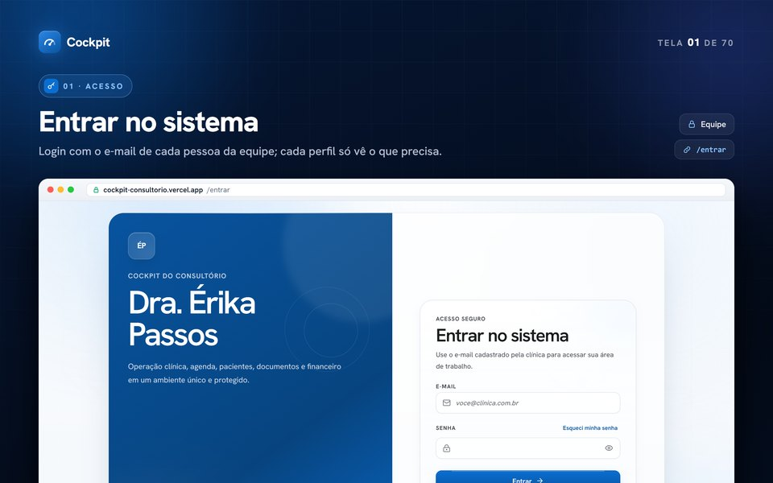</a> <b>01 · Entrar no sistema</b> Login com o e-mail de cada pessoa da equipe; cada perfil só vê o que precisa. 👤 Equipe · <code>/entrar</code></td>
<td width="50%" valign="top"><a href="01-acesso/02-entrar-erro.png">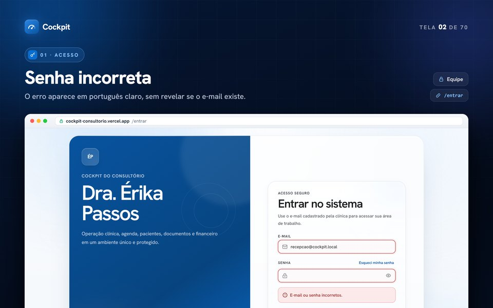</a> <b>02 · Senha incorreta</b> O erro aparece em português claro, sem revelar se o e-mail existe. 👤 Equipe · <code>/entrar</code></td>
</tr>
<tr>
<td width="50%" valign="top"> <b>03 · Esqueci minha senha</b> Pedido de link seguro para criar uma senha nova, com a mesma resposta para qualquer e-mail. 👤 Equipe · <code>/recuperar-senha</code></td>
<td width="50%" valign="top"> <b>04 · Redefinir senha</b> Tela aberta pelo link do e-mail; sem um link válido, explica o que fazer. 👤 Equipe · <code>/redefinir-senha</code></td>
</tr>
</table>

## 02 · Visão Geral

<table>
<tr>
<td width="50%" valign="top"> <b>05 · Visão Geral</b> O painel do dia: números de hoje e do mês, agenda com o marcador de agora, pendências, retornos e aniversariantes. 👤 Administradora · <code>/</code></td>
<td width="50%" valign="top"> <b>06 · Visão Geral da recepção</b> Cada perfil vê o seu painel: despesas e resultado ficam restritos ao financeiro. 👤 Recepção · <code>/</code></td>
</tr>
</table>

## 03 · Agenda

<table>
<tr>
<td width="50%" valign="top"> <b>07 · Agenda do dia</b> Atendimentos em ordem, com situação por cor, ícone e texto, e as ações de cada um: confirmar, iniciar, concluir. 👤 Administradora · <code>/agenda?dia=2026-09-24</code></td>
<td width="50%" valign="top"><a href="03-agenda/08-agenda-novo.png">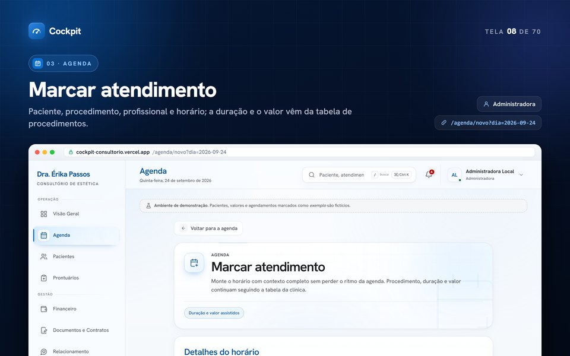</a> <b>08 · Marcar atendimento</b> Paciente, procedimento, profissional e horário; a duração e o valor vêm da tabela de procedimentos. 👤 Administradora · <code>/agenda/novo?dia=2026-09-24</code></td>
</tr>
<tr>
<td width="50%" valign="top"> <b>09 · Horário ocupado</b> Dois atendimentos no mesmo horário não entram: o sistema avisa no próprio campo, e o banco de dados também recusa. 👤 Administradora · <code>/agenda/novo?dia=2026-09-24</code></td>
<td width="50%" valign="top"> <b>10 · Remarcar ou editar</b> Mudar horário, profissional ou procedimento de um atendimento, com o histórico de quem mudou e quando. 👤 Administradora · <code>/agenda/203eca32-8b5a-462a-80bc-60a14c259c6a/editar</code></td>
</tr>
</table>

## 04 · Pacientes

<table>
<tr>
<td width="50%" valign="top"><a href="04-pacientes/11-pacientes.png">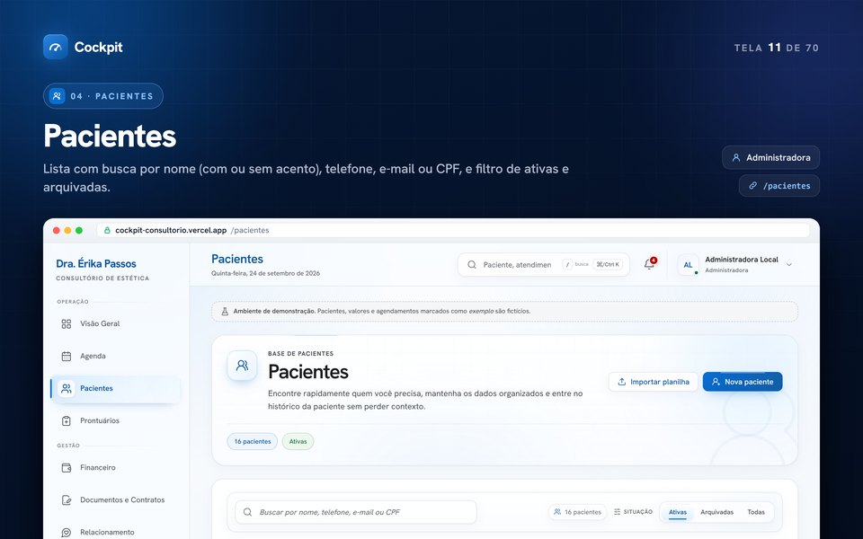</a> <b>11 · Pacientes</b> Lista com busca por nome (com ou sem acento), telefone, e-mail ou CPF, e filtro de ativas e arquivadas. 👤 Administradora · <code>/pacientes</code></td>
<td width="50%" valign="top"><a href="04-pacientes/12-pacientes-busca.png">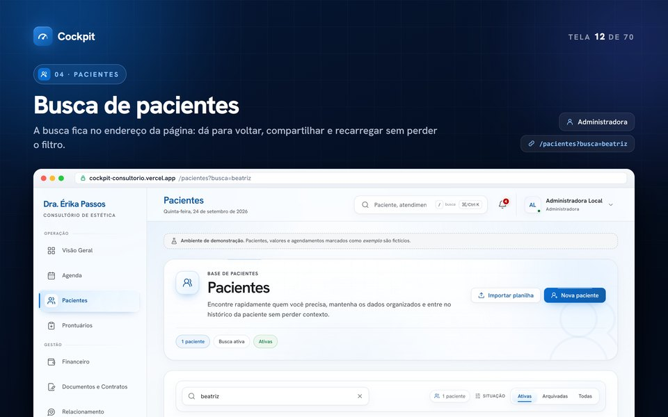</a> <b>12 · Busca de pacientes</b> A busca fica no endereço da página: dá para voltar, compartilhar e recarregar sem perder o filtro. 👤 Administradora · <code>/pacientes?busca=beatriz</code></td>
</tr>
<tr>
<td width="50%" valign="top"><a href="04-pacientes/13-paciente-ficha.png">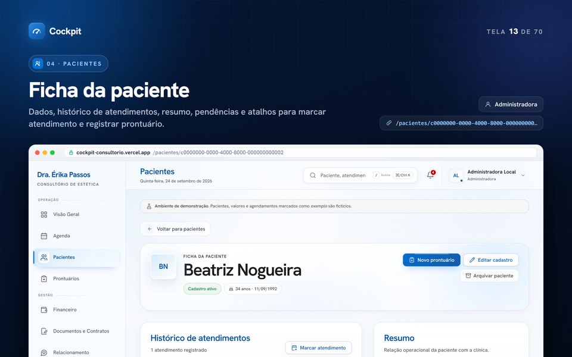</a> <b>13 · Ficha da paciente</b> Dados, histórico de atendimentos, resumo, pendências e atalhos para marcar atendimento e registrar prontuário. 👤 Administradora · <code>/pacientes/c0000000-0000-4000-8000-000000000002</code></td>
<td width="50%" valign="top"><a href="04-pacientes/14-paciente-editar.png">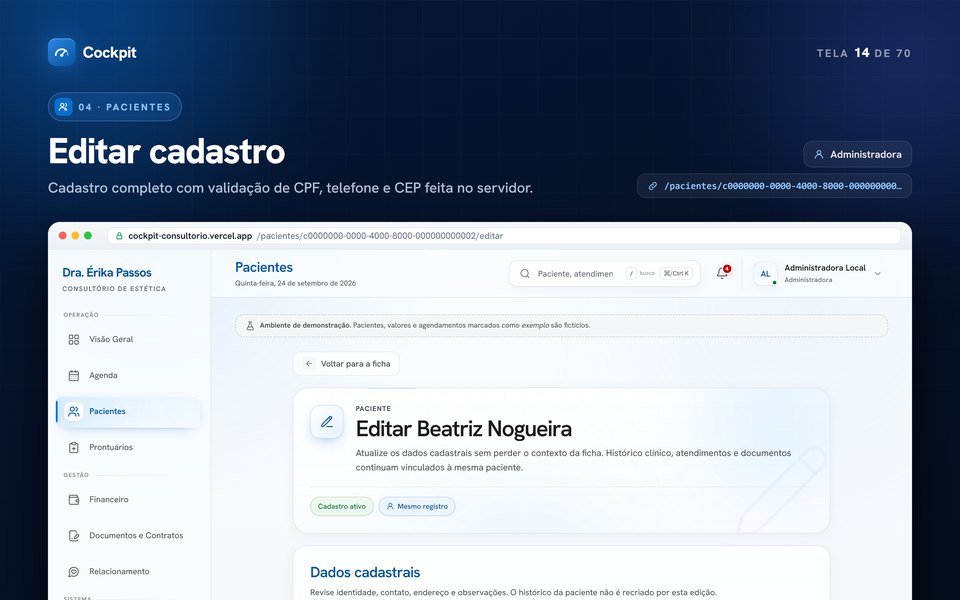</a> <b>14 · Editar cadastro</b> Cadastro completo com validação de CPF, telefone e CEP feita no servidor. 👤 Administradora · <code>/pacientes/c0000000-0000-4000-8000-000000000002/editar</code></td>
</tr>
<tr>
<td width="50%" valign="top"><a href="04-pacientes/15-paciente-nova.png">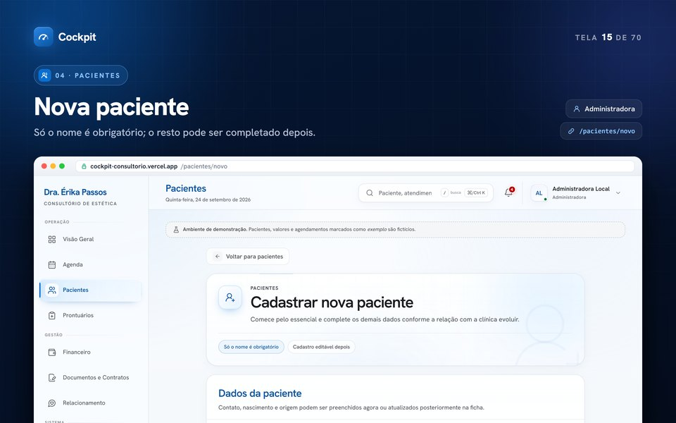</a> <b>15 · Nova paciente</b> Só o nome é obrigatório; o resto pode ser completado depois. 👤 Administradora · <code>/pacientes/novo</code></td>
<td width="50%" valign="top"> <b>16 · Erro no próprio campo</b> CPF inválido: o erro aparece junto do campo, o foco vai até ele e o resto do que foi digitado fica. 👤 Administradora · <code>/pacientes/novo</code></td>
</tr>
<tr>
<td width="50%" valign="top"><a href="04-pacientes/17-importar.png">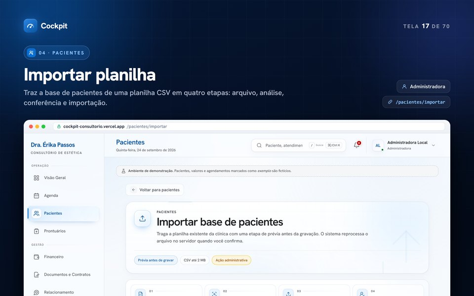</a> <b>17 · Importar planilha</b> Traz a base de pacientes de uma planilha CSV em quatro etapas: arquivo, análise, conferência e importação. 👤 Administradora · <code>/pacientes/importar</code></td>
<td width="50%" valign="top"> <b>18 · Prévia da importação</b> Cada linha conferida antes de gravar: erros, avisos e duplicidades; só entra o que você confirmar. 👤 Administradora · <code>/pacientes/importar</code></td>
</tr>
</table>

## 05 · Prontuários

<table>
<tr>
<td width="50%" valign="top"><a href="05-prontuarios/19-prontuarios.png">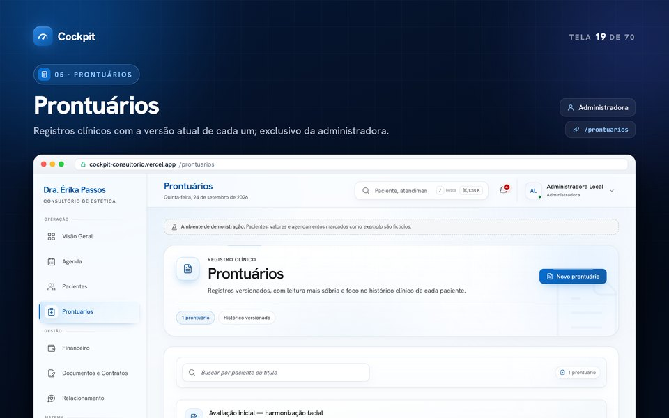</a> <b>19 · Prontuários</b> Registros clínicos com a versão atual de cada um; exclusivo da administradora. 👤 Administradora · <code>/prontuarios</code></td>
<td width="50%" valign="top"> <b>20 · Prontuário</b> Registro atual, histórico de versões (editar nunca apaga) e fotos de evolução em armazenamento privado. 👤 Administradora · <code>/prontuarios/1961e61a-ce17-44dc-9ee4-cd1d03e01fa7</code></td>
</tr>
<tr>
<td width="50%" valign="top"> <b>21 · Nova versão do prontuário</b> Toda edição vira uma versão nova, com o motivo; as anteriores continuam guardadas. 👤 Administradora · <code>/prontuarios/1961e61a-ce17-44dc-9ee4-cd1d03e01fa7/editar</code></td>
<td width="50%" valign="top"><a href="05-prontuarios/22-prontuario-novo.png">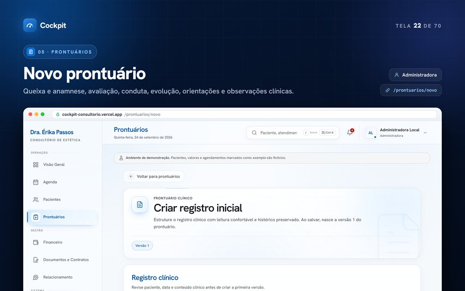</a> <b>22 · Novo prontuário</b> Queixa e anamnese, avaliação, conduta, evolução, orientações e observações clínicas. 👤 Administradora · <code>/prontuarios/novo</code></td>
</tr>
<tr>
<td width="50%" valign="top"><a href="05-prontuarios/23-prontuario-restrito.png">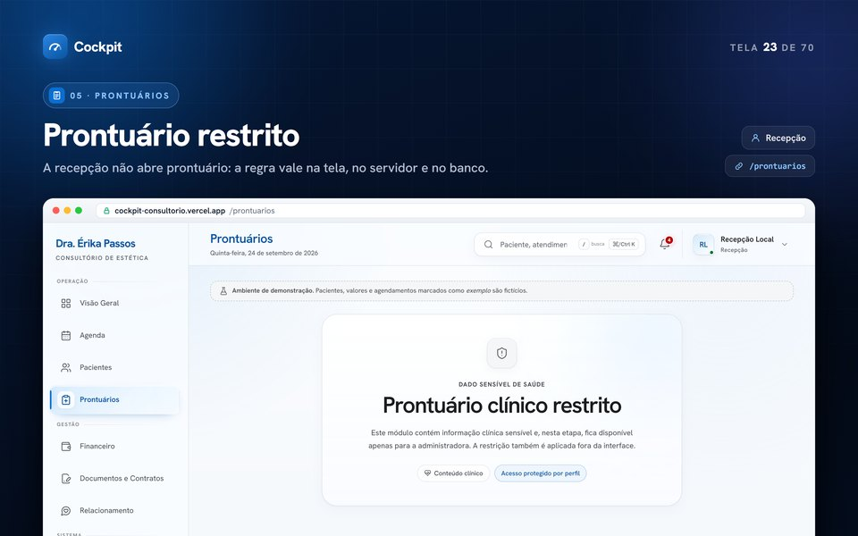</a> <b>23 · Prontuário restrito</b> A recepção não abre prontuário: a regra vale na tela, no servidor e no banco. 👤 Recepção · <code>/prontuarios</code></td>
<td width="50%"></td>
</tr>
</table>

## 06 · Financeiro

<table>
<tr>
<td width="50%" valign="top"> <b>24 · Visão financeira</b> Indicadores do mês — vendido, recebido, taxas, líquido, a receber, despesas e resultado — e as últimas movimentações. 👤 Administradora · <code>/financeiro</code></td>
<td width="50%" valign="top"><a href="06-financeiro/25-vendas.png">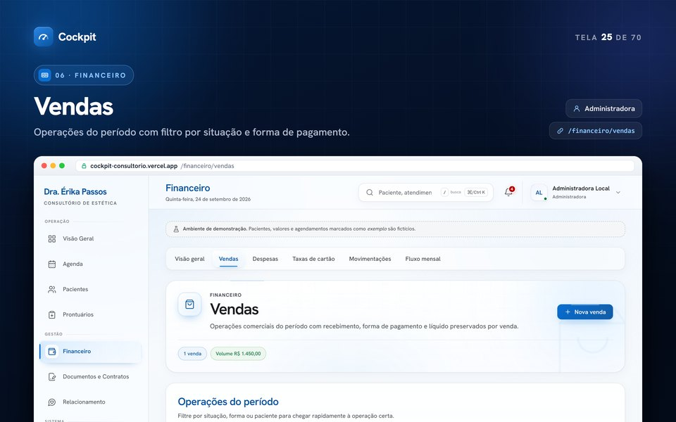</a> <b>25 · Vendas</b> Operações do período com filtro por situação e forma de pagamento. 👤 Administradora · <code>/financeiro/vendas</code></td>
</tr>
<tr>
<td width="50%" valign="top"> <b>26 · Registrar venda</b> Procedimento, valor, desconto e forma de pagamento; tudo nasce da venda. 👤 Administradora · <code>/financeiro/vendas/nova</code></td>
<td width="50%" valign="top"> <b>27 · Prévia do líquido</b> No cartão, a taxa da operadora entra sozinha e a prévia mostra quanto a clínica realmente recebe. 👤 Administradora · <code>/financeiro/vendas/nova</code></td>
</tr>
<tr>
<td width="50%" valign="top"> <b>28 · Detalhe da venda</b> Composição do valor ao líquido e o recebimento, com divergência marcada quando entra valor diferente. 👤 Administradora · <code>/financeiro/vendas/76b71432-1273-4a96-b5b1-a18deb850ac2</code></td>
<td width="50%" valign="top"> <b>29 · Alterar forma de pagamento</b> Mudança depois de registrada, só para o financeiro, com o antes e o depois lado a lado. 👤 Administradora · <code>/financeiro/vendas/76b71432-1273-4a96-b5b1-a18deb850ac2/alterar-pagamento</code></td>
</tr>
<tr>
<td width="50%" valign="top"> <b>30 · Alterar taxa da venda</b> Taxa diferente da tabela só entra com justificativa; a tabela padrão não muda. 👤 Administradora · <code>/financeiro/vendas/76b71432-1273-4a96-b5b1-a18deb850ac2/alterar-taxa</code></td>
<td width="50%" valign="top"><a href="06-financeiro/31-movimentacoes.png">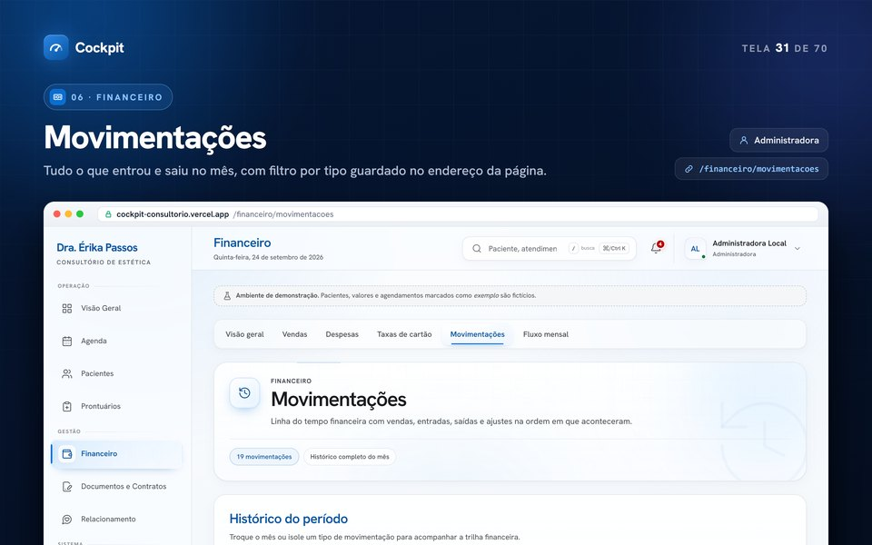</a> <b>31 · Movimentações</b> Tudo o que entrou e saiu no mês, com filtro por tipo guardado no endereço da página. 👤 Administradora · <code>/financeiro/movimentacoes</code></td>
</tr>
<tr>
<td width="50%" valign="top"><a href="06-financeiro/32-despesas.png">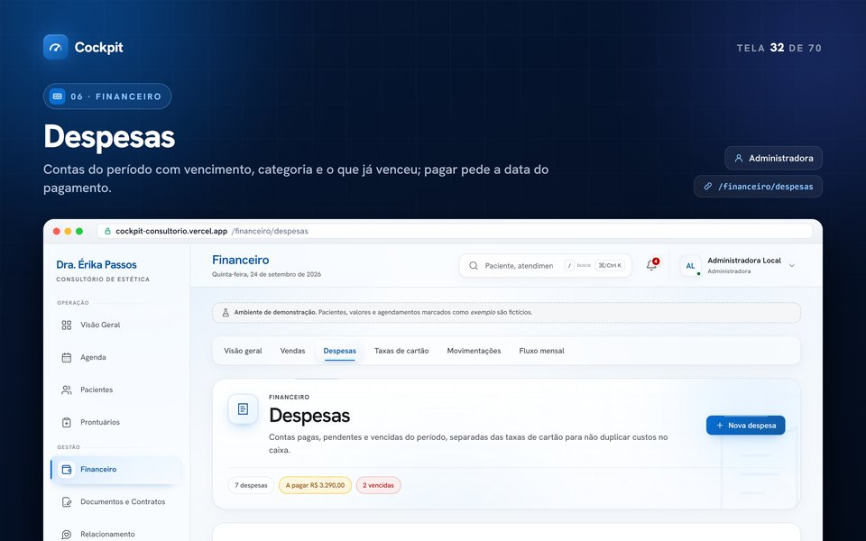</a> <b>32 · Despesas</b> Contas do período com vencimento, categoria e o que já venceu; pagar pede a data do pagamento. 👤 Administradora · <code>/financeiro/despesas</code></td>
<td width="50%" valign="top"><a href="06-financeiro/33-despesa-nova.png">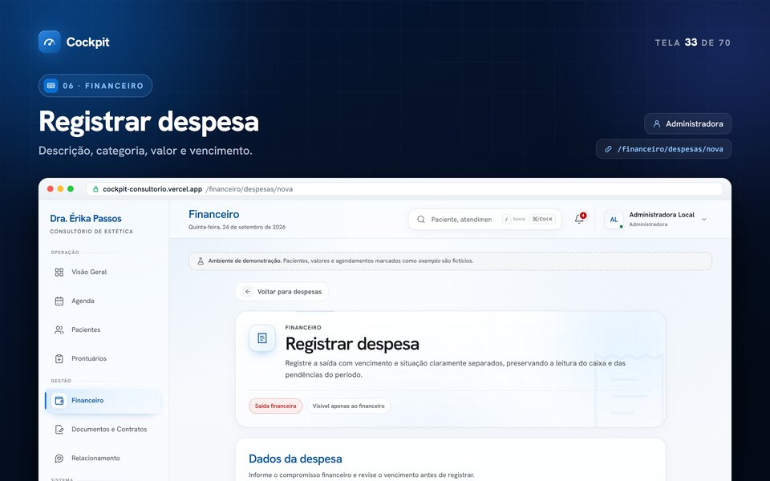</a> <b>33 · Registrar despesa</b> Descrição, categoria, valor e vencimento. 👤 Administradora · <code>/financeiro/despesas/nova</code></td>
</tr>
<tr>
<td width="50%" valign="top"><a href="06-financeiro/34-despesa-editar.png">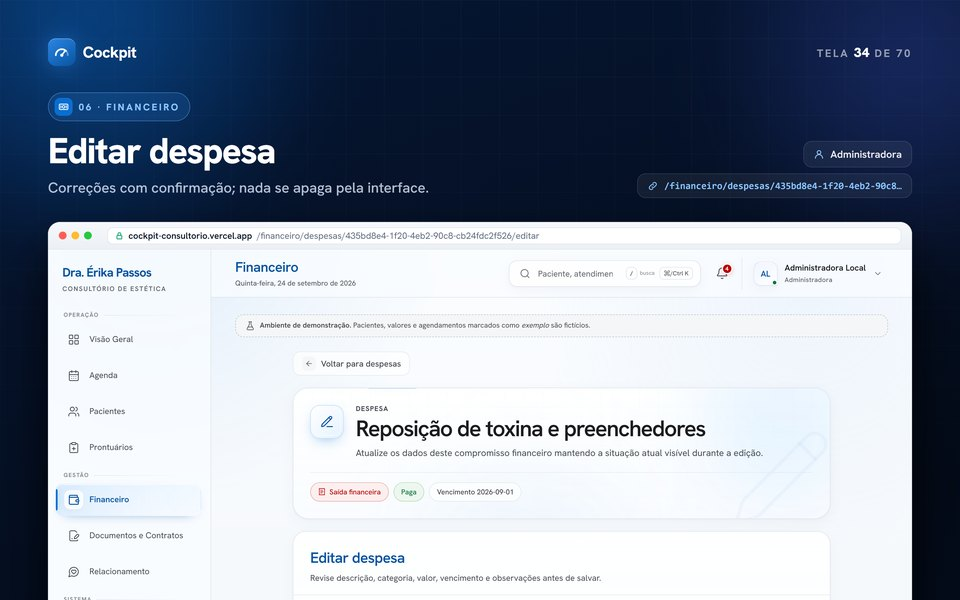</a> <b>34 · Editar despesa</b> Correções com confirmação; nada se apaga pela interface. 👤 Administradora · <code>/financeiro/despesas/435bd8e4-1f20-4eb2-90c8-cb24fdc2f526/editar</code></td>
<td width="50%" valign="top"><a href="06-financeiro/35-taxas.png">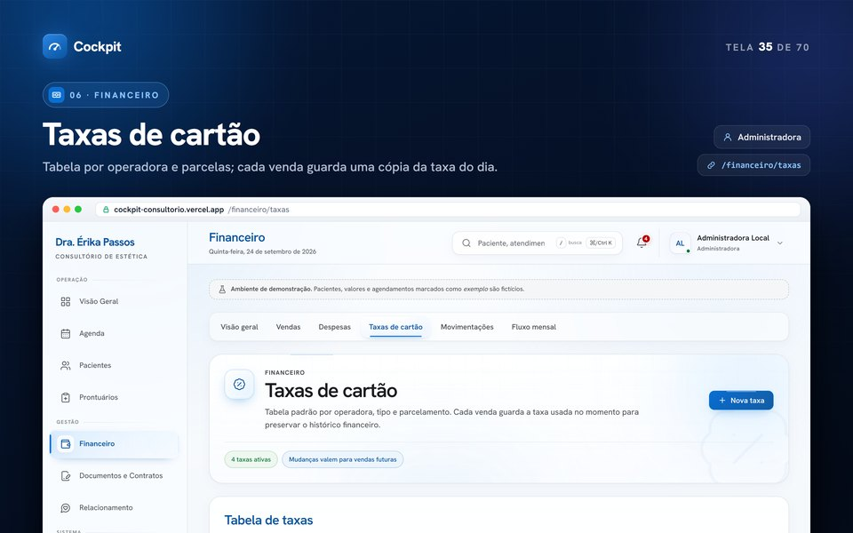</a> <b>35 · Taxas de cartão</b> Tabela por operadora e parcelas; cada venda guarda uma cópia da taxa do dia. 👤 Administradora · <code>/financeiro/taxas</code></td>
</tr>
<tr>
<td width="50%" valign="top"> <b>36 · Nova taxa de cartão</b> Operadora, tipo (crédito ou débito), parcelas e percentual. 👤 Administradora · <code>/financeiro/taxas/nova</code></td>
<td width="50%" valign="top"><a href="06-financeiro/37-taxa-editar.png">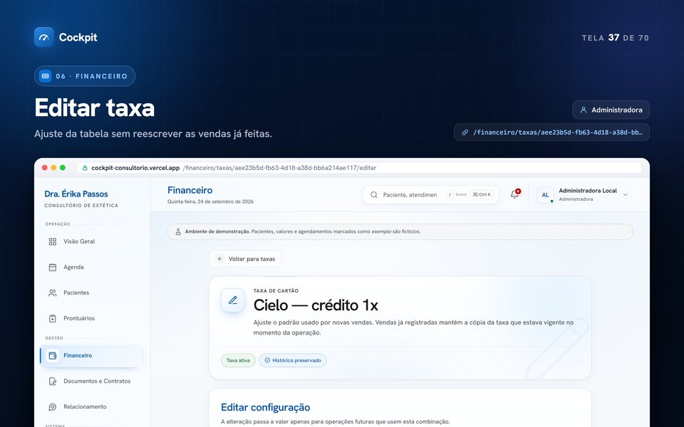</a> <b>37 · Editar taxa</b> Ajuste da tabela sem reescrever as vendas já feitas. 👤 Administradora · <code>/financeiro/taxas/aee23b5d-fb63-4d18-a38d-bb6a214ae117/editar</code></td>
</tr>
<tr>
<td width="50%" valign="top"> <b>38 · Fluxo mensal</b> Recebido líquido, despesas pagas, resultado e acumulado, mês a mês. 👤 Administradora · <code>/financeiro/fluxo</code></td>
<td width="50%"></td>
</tr>
</table>

## 07 · Documentos e Contratos

<table>
<tr>
<td width="50%" valign="top"><a href="07-documentos/39-documentos.png">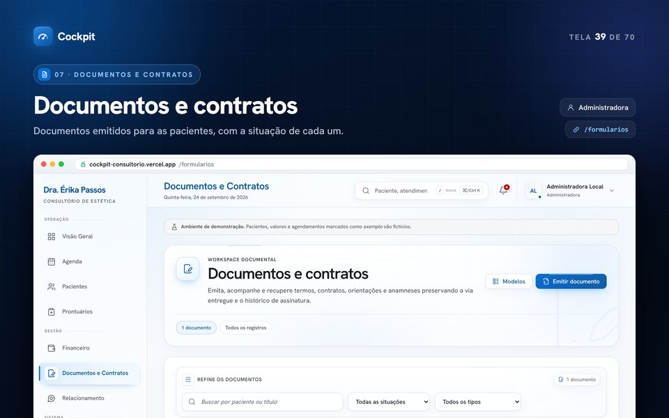</a> <b>39 · Documentos e contratos</b> Documentos emitidos para as pacientes, com a situação de cada um. 👤 Administradora · <code>/formularios</code></td>
<td width="50%" valign="top"> <b>40 · Documento assinado</b> Texto congelado com impressão digital (SHA-256), evidências da assinatura e a via da paciente pelo link. 👤 Administradora · <code>/formularios/875b66a5-6d17-4409-a987-be7e7e3b853f</code></td>
</tr>
<tr>
<td width="50%" valign="top"> <b>41 · Emitir documento</b> Escolhe o modelo, confere a prévia e emite: o texto é congelado na hora. 👤 Administradora · <code>/formularios/novo?paciente=c0000000-0000-4000-8000-000000000002</code></td>
<td width="50%" valign="top"><a href="07-documentos/42-modelos.png">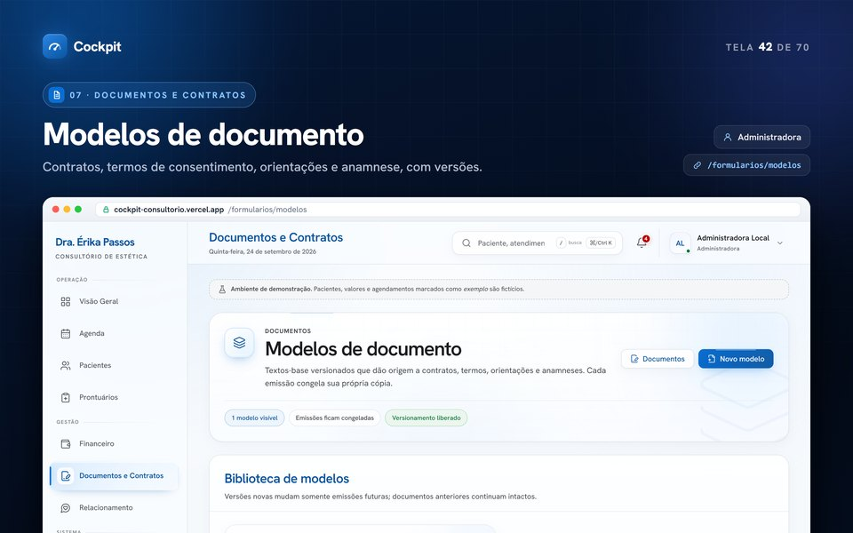</a> <b>42 · Modelos de documento</b> Contratos, termos de consentimento, orientações e anamnese, com versões. 👤 Administradora · <code>/formularios/modelos</code></td>
</tr>
<tr>
<td width="50%" valign="top"><a href="07-documentos/43-modelo-novo.png">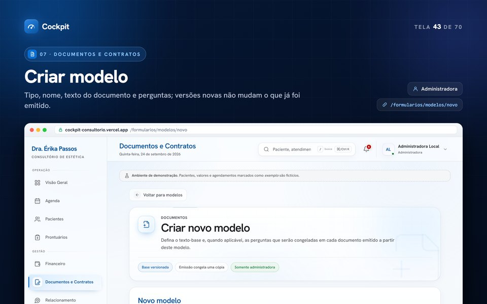</a> <b>43 · Criar modelo</b> Tipo, nome, texto do documento e perguntas; versões novas não mudam o que já foi emitido. 👤 Administradora · <code>/formularios/modelos/novo</code></td>
<td width="50%" valign="top"> <b>44 · Nova versão do modelo</b> Editar um modelo cria a versão seguinte; os documentos antigos continuam com o texto deles. 👤 Administradora · <code>/formularios/modelos/1d816d89-381e-45e0-ad17-36a2cd5cf032/editar</code></td>
</tr>
</table>

## 08 · Assinatura pelo celular

<table>
<tr>
<td width="50%" valign="top"> <b>45 · Link inválido</b> Link de assinatura errado ou vencido: a página não mostra nada do documento. 👤 Paciente · <code>/assinar/…</code></td>
<td width="50%" valign="top"> <b>46 · Link seguro para assinar</b> A clínica gera o link com validade e envia pelo WhatsApp com a mensagem pronta. 👤 Administradora · <code>/formularios/9c2805d1-4778-42bc-b964-1bc7c9c32a3b</code></td>
</tr>
<tr>
<td width="50%" valign="top"> <b>47 · Confirmar a data de nascimento</b> A paciente abre o link no celular e confirma a data de nascimento antes de ver o documento. 👤 Paciente · <code>/assinar/…</code></td>
<td width="50%" valign="top"> <b>48 · Ler o documento</b> O texto completo, com a identificação que prova que ele não muda depois de assinado. 👤 Paciente · <code>/assinar/…</code></td>
</tr>
<tr>
<td width="50%" valign="top"> <b>49 · Assinar</b> Nome completo, CPF opcional e a confirmação de leitura. 👤 Paciente · <code>/assinar/…</code></td>
<td width="50%" valign="top"> <b>50 · Assinado</b> Assinatura registrada e a via da paciente para salvar em PDF. 👤 Paciente · <code>/assinar/…</code></td>
</tr>
</table>

## 09 · Relacionamento

<table>
<tr>
<td width="50%" valign="top"> <b>51 · Relacionamento</b> A fila da equipe: confirmações, retornos, tarefas e convites de avaliação. 👤 Administradora · <code>/relacionamento</code></td>
<td width="50%" valign="top"> <b>52 · Confirmações</b> Atendimentos dos próximos 15 dias sem confirmação, com o WhatsApp da paciente a um clique. 👤 Administradora · <code>/relacionamento?aba=confirmacoes</code></td>
</tr>
<tr>
<td width="50%" valign="top"> <b>53 · Retornos</b> Quem está no período de voltar, com a situação de cada contato. 👤 Administradora · <code>/relacionamento?aba=retornos</code></td>
<td width="50%" valign="top"> <b>54 · Aniversários</b> Aniversariantes do mês com a mensagem pronta para enviar. 👤 Administradora · <code>/relacionamento?aba=aniversarios</code></td>
</tr>
<tr>
<td width="50%" valign="top"> <b>55 · Avaliações no Google</b> Convite para avaliar a clínica depois de um bom atendimento, com um toque. 👤 Administradora · <code>/relacionamento?aba=avaliacoes</code></td>
<td width="50%" valign="top"> <b>56 · Tarefas</b> O que a equipe precisa fazer, com prazo e prioridade. 👤 Administradora · <code>/relacionamento?aba=tarefas</code></td>
</tr>
<tr>
<td width="50%" valign="top"><a href="09-relacionamento/57-retorno-novo.png">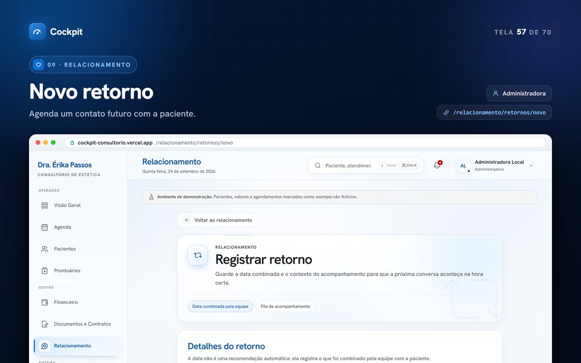</a> <b>57 · Novo retorno</b> Agenda um contato futuro com a paciente. 👤 Administradora · <code>/relacionamento/retornos/novo</code></td>
<td width="50%" valign="top"><a href="09-relacionamento/58-tarefa-nova.png">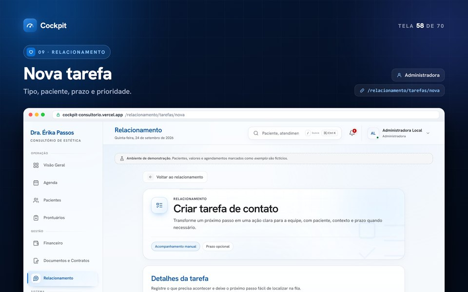</a> <b>58 · Nova tarefa</b> Tipo, paciente, prazo e prioridade. 👤 Administradora · <code>/relacionamento/tarefas/nova</code></td>
</tr>
</table>

## 10 · Busca e Configurações

<table>
<tr>
<td width="50%" valign="top"><a href="10-busca-e-configuracoes/59-busca.png">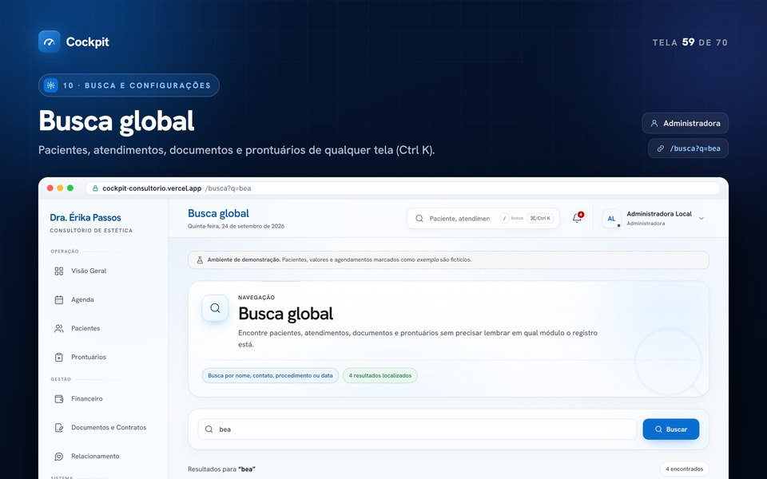</a> <b>59 · Busca global</b> Pacientes, atendimentos, documentos e prontuários de qualquer tela (Ctrl K). 👤 Administradora · <code>/busca?q=bea</code></td>
<td width="50%" valign="top"> <b>60 · Configurações</b> Áreas do sistema; o que ainda está a caminho aparece marcado. 👤 Administradora · <code>/configuracoes</code></td>
</tr>
<tr>
<td width="50%" valign="top"><a href="10-busca-e-configuracoes/61-procedimentos.png">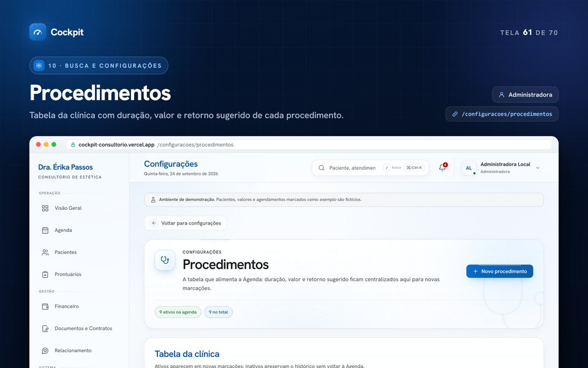</a> <b>61 · Procedimentos</b> Tabela da clínica com duração, valor e retorno sugerido de cada procedimento. 👤 Administradora · <code>/configuracoes/procedimentos</code></td>
<td width="50%" valign="top"> <b>62 · Novo procedimento</b> Nome, duração, valor e retorno sugerido. 👤 Administradora · <code>/configuracoes/procedimentos/novo</code></td>
</tr>
<tr>
<td width="50%" valign="top"> <b>63 · Editar procedimento</b> Mudanças valem para os próximos atendimentos. 👤 Administradora · <code>/configuracoes/procedimentos/b0000000-0000-4000-8000-000000000008/editar</code></td>
<td width="50%" valign="top"> <b>64 · Conferência das fotos</b> Reconcilia os arquivos do armazenamento com o prontuário. 👤 Administradora · <code>/configuracoes/fotos</code></td>
</tr>
<tr>
<td width="50%" valign="top"> <b>65 · Relatórios</b> Módulo em preparação: a tela avisa o que está a caminho. 👤 Administradora · <code>/relatorios</code></td>
<td width="50%"></td>
</tr>
</table>

## 11 · No celular

<table>
<tr>
<td width="50%" valign="top"> <b>66 · Visão Geral no celular</b> O painel inteiro se reorganiza para a tela pequena. 👤 Administradora · <code>/</code></td>
<td width="50%" valign="top"> <b>67 · Agenda no celular</b> Confirmar, iniciar e concluir atendimentos pelo celular. 👤 Administradora · <code>/agenda?dia=2026-09-24</code></td>
</tr>
<tr>
<td width="50%" valign="top"><a href="11-no-celular/68-cel-pacientes.png">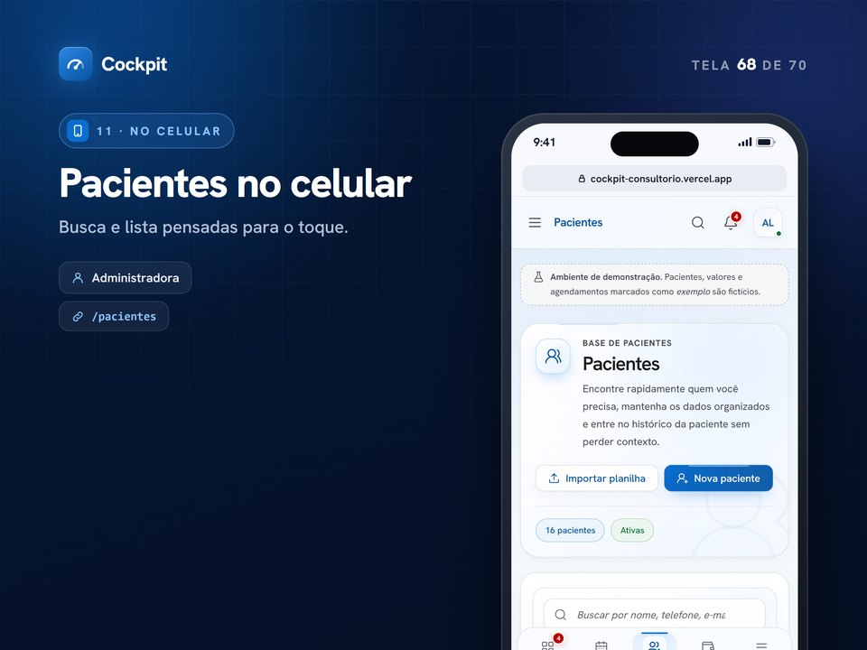</a> <b>68 · Pacientes no celular</b> Busca e lista pensadas para o toque. 👤 Administradora · <code>/pacientes</code></td>
<td width="50%" valign="top"> <b>69 · Ficha no celular</b> A ficha completa da paciente, com WhatsApp a um toque. 👤 Administradora · <code>/pacientes/c0000000-0000-4000-8000-000000000002</code></td>
</tr>
<tr>
<td width="50%" valign="top"> <b>70 · Confirmações no celular</b> A recepção confirma a agenda do dia sem sair do celular. 👤 Administradora · <code>/relacionamento?aba=confirmacoes</code></td>
<td width="50%"></td>
</tr>
</table>
